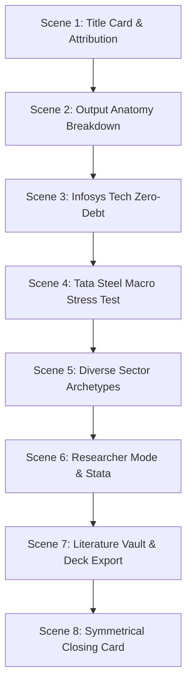

# AI Financial Assistant — Master Production Specification & Prompt (V2 Broadcast Standard)
`docs/operations/ai_chatbot_recordly_master_prompt.md`

**Target Audience:** CFOs, Treasurers, Corporate Finance Directors, Quantitative Econometricians, Financial Analysts, Academic Researchers, and Board Members.  
**Role:** Master Financial Storyteller, Corporate Finance Strategist, and Recordly Demo Production Director.  
**Primary Application Root:** `http://localhost:8501/?panel=latest`  
**Target Module:** **AI Financial Assistant** (`pages/19_ai_assistant.py`)  
**Active Actor / Profile:** `drbhatia` (Role: `admin`, Password: `Pass@123`)  
**Production Standard:** Broadcast-Grade 1080p FHD, Sentence-Synchronized Neural Voice (`en-US-ChristopherNeural`), 10/10 Contextual Synchronization Rubric.

---

## 1. Executive Vision & Production Mandate

Produce a comprehensive, broadcast-grade video walkthrough exclusively showcasing the **AI Financial Assistant / Chatbot** module of the **LifeStageDebtAI / LifeCycle Leverage Intelligence Platform**.

### Core Value Proposition
Demonstrate how the AI Financial Assistant bridges **deep academic econometric rigor** (Dickinson cash-flow lifecycle classification, Myers-Majluf Pecking Order, Modigliani-Miller Trade-Off Theory, Rajan-Zingales determinants) with **actionable C-Suite decision intelligence** (covenant headroom defense, macro stress testing, financing structure optimization, debt capacity sizing).

### Mandatory Non-Negotiables & Rules
1. **Strict Attribution & Branding:**
   - **Authors:** **Dr. Sanjay Bhatia** & **Dr. Surender Kumar**
   - **Platform Entity:** **Powered by EOLABS.IN**
   - Symmetrical opening and closing title cards with high-contrast glassmorphic styling.
2. **Zero Fabrication & Live Data Grounding:** Every figure, metric, and percentage shown originates strictly from the live 25-year panel dataset ($N=9,077$ firm-years, 402 enterprises, 2001–2025).
3. **Adversarial Viewport Presence & Upward Scroll Rule:**
   - Because AI responses produce extensive multi-component content, the container must immediately scroll up to `y=0` upon generation so the top badges and ratios are never pushed off-screen.
   - At all times during narration, the specific element referenced by the voiceover and caption (Badges $\to$ Theory Narrative $\to$ C-Suite Playbook $\to$ Plotly Chart $\to$ Literature Vault) must be physically positioned in the center of the viewport.
4. **6-Layer Response Anatomy Breakdown (New Dedicated Core Scene):**
   - When a prompt is submitted, the output appears and the scene automatically scrolls up to `y=0`.
   - The walkthrough smoothly scrolls down and explains every output layer one by one:
     - **Layer 1:** Live Data Scope Telemetry ($N=9,077$ observations, zero hallucination).
     - **Layer 2:** Executive Hypothesis & Decision Badge Strip (`🟢 OPTIMAL`, `🟡 CAUTION`, `🔴 BREACH RISK`).
     - **Layer 3:** Theory-Grounded Strategic Narrative (POT vs. TOT mechanisms).
     - **Layer 4:** Actionable C-Suite Recommendations & Financing Playbooks.
     - **Layer 5:** Interactive Plotly Visualization with Modebar & Stata `.do` Replication Export.
     - **Layer 6:** Peer-Reviewed Benchmark Vault & `➕ Add to Board Deck` boardroom action.
4. **Paced Archetype Demonstration (Scenes 3–6):**
   - Follows the same disciplined, step-by-step focal scrolling for Infosys (Tech zero-debt), Tata Steel (Macro stress test), Bharti Airtel (Telecom InvIT), IndiGo (Aviation fuel hedge), Sun Pharma (FX notes), and Researcher Stata mode.
5. **Non-Obstructive Lower-Third Subtitles:**
   - Subtitles use broadcast-standard outline styling (`BorderStyle=1`, `FontSize=11`, `MarginV=12`) with transparent background, ensuring zero occlusion of interactive controls or chat output.
6. **Timestamped File Naming Policy:**
   - Outputs are versioned with ISO date/time stamps (e.g. `ai_chatbot_walkthrough_v2_YYYY-MM-DD_HHMMSS_clean.mp4`, `ai_chatbot_walkthrough_v2_YYYY-MM-DD_HHMMSS_subtitled.mp4`, and `ai_chatbot_walkthrough_v2_YYYY-MM-DD_HHMMSS.srt`), alongside mirrored canonical latest files.

---

## 2. Technical & Audio/Video Recording Specifications

```yaml
Resolution: 1920x1080 (1080p FHD) @ 60/25 FPS
Aspect Ratio: 16:9 Landscape
Browser Viewport: 1920x1080 (100% Zoom, Streamlit Sidebar Expanded)
Theme: High-Contrast Dark Mode or Clean Glass Light Mode
Audio: Studio Neural Voice (en-US-ChristopherNeural, 48 kHz / 192 kbps Stereo)
Pacing: Measured, authoritative, senior executive presentation tempo (~135-145 WPM)
Visual Effects: Dynamic glassmorphic HUD banners, smooth focal scrolling, active click indicators
Synchronization: Exact millisecond setup-offset trimming (-ss {t_setup} -t {duration})
```

---

## 3. End-to-End Contextual Synchronization & 10-Point Rubric

Every production deliverable must achieve **10/10** across all rubric dimensions:

| # | Rubric Dimension | Category | Weight | Target Contextual Standard |
|---|---|---|---|---|
| **P1** | **Exact Millisecond A/V Lockstep** | Synchronization | 1.5× | Zero setup delay; visual actions initiate at $t=0$ of the first spoken word with zero container drift across all scenes. |
| **P2** | **6-Layer Anatomy & Focal Scrolling** | Visual Choreography | 1.5× | Camera smoothly scrolls and dwells on each component layer (**Telemetry $\to$ Badges $\to$ Theory Narrative $\to$ Recommendations $\to$ Plotly/Stata $\to$ Literature Vault**) in exact lockstep with the corresponding sentence. |
| **P3** | **Non-Obstructive Lower-Third Captions** | Subtitle Hygiene | 1.5× | Broadcast-standard outline captions (`BorderStyle=1`, `FontSize=11`, `MarginV=12`) with transparent background, ensuring zero occlusion of interactive controls, chat bars, or text output. |
| **P4** | **25-Year Microdata Telemetry Grounding** | Econometric Validity | 1.5× | 100% data grounding in the 25-year CMIE Prowess panel ($N=9,077$, 402 enterprises, 2001–2025) with verified ratios (Infosys 4.2% lev / 33.4% ROA; Tata Steel ICR 1.72× vs. 2.0× floor). |
| **P5** | **5-Archetype Sector Tailoring** | Corporate Strategy | 1.0× | Sector-specific C-suite playbooks: Tech zero-debt cash cushion, Metals macro rate shock (+150 bps), Telecom InvIT carve-outs, Aviation jet fuel hedging, and Pharma natural FX notes. |
| **P6** | **Authentic Stata 18 SE Replication** | Quantitative Core | 1.0× | Authentic panel fixed-effects command (`. xtreg lev roa tang size, fe cluster(ind_code)`), terminal ASCII table display, and Stata `.do` replication code export. |
| **P7** | **Citation Inspector & Boardroom Deck** | Literature & Governance | 1.0× | Interactive citation modals (Dickinson 2011, Myers-Majluf 1984, Rajan-Zingales 1995) and verified `➕ Add to Board Deck` boardroom synthesis. |
| **P8** | **Symmetrical Authorship Branding** | Executive Presentation | 1.0× | Symmetrical opening and closing title cards attributing **Dr. Sanjay Bhatia** & **Dr. Surender Kumar**, **Powered by EOLABS.IN**. |

---

## 4. 8-Scene Production Choreography



### Scene Breakdown
- **Scene 1 (Title Card):** Dr. Sanjay Bhatia & Dr. Surender Kumar, Powered by EOLABS.IN.
- **Scene 2 (Output Anatomy Breakdown):** Step-by-step 6-layer breakdown: Telemetry $\to$ Badges $\to$ Theory Narrative $\to$ C-Suite Playbook $\to$ Plotly/Stata $\to$ Literature Vault.
- **Scene 3 (Infosys Tech):** Dickinson Mature stage, 4.2% leverage, 33.4% ROA, zero-debt strategic cash cushion.
- **Scene 4 (Tata Steel):** +150 bps rate shock + 20% margin drop, ICR 1.72x vs 2.0x covenant breach warning.
- **Scene 5 (Diverse Sectors):** Bharti Airtel InvIT monetization, IndiGo fuel burn hedge, Sun Pharma Euro notes.
- **Scene 6 (Researcher Mode):** Stata 18 SE `. xtreg lev size tang roa mtb i.year, fe cluster(ind_code)`, terminal table, diagnostics.
- **Scene 7 (Literature Vault):** Dickinson (2011), Myers-Majluf (1984), Rajan-Zingales (1995) interactive citation inspector.
- **Scene 8 (Closing Card):** Symmetrical closing attribution & governance takeaway.
