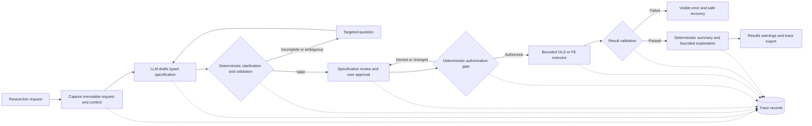

# Executive High-Level Design — Guided Statistical Analysis in ProfSur

**Harness:** KAIF agentic-design-harness v1.3.0  
**Run date:** 2026-09-18  
**Status:** Approval-ready design; stakeholder approvals and production policy decisions remain pending  
**Audience:** ProfSur leadership, product, research/method owners, architecture, security, and operations  
**Source baseline:** ProfSur `fa97df7e1e6b43726c63590a47906d8ae8e5797d`; KAIF `6da1d29ec11ee6c30e1c347e45eb4b58ca153f7b`

## 1. Executive summary

ProfSur should add a guided statistical-analysis workflow that converts a researcher's natural-language request into an explicit, reviewable statistical specification before any computation occurs. The first delivery slice covers OLS and fixed-effects regression, company and year fixed effects, company-clustered standard errors, variable/sample validation, clarification, execution validation, responsible explanation, visible warnings/errors, and end-to-end traceability.

The recommended architecture is deliberately simple: an **LLM-assisted workflow inside the existing ProfSur application**, not an autonomous or multi-agent system. The language model drafts a typed specification and may help phrase an explanation. Deterministic code owns method support, variable resolution, ambiguity, data checks, user approval, authorization, execution, result validation, warning severity, and audit records. If the model is unavailable, users can complete the same specification through a deterministic form.

The design reuses ProfSur's Streamlit shell, authenticated sessions, active panel data, Stata-style engine, econometric functions, chat persistence, and provider-neutral validation vocabulary. It preserves the current Cloud Run managed-container deployment. Kubernetes, MCP, long-term memory, GraphRAG, a new vector database, a new model, and a platform rewrite are not justified by this use case.

Leadership approval is requested for the bounded scope, deterministic-control principle, operating ownership, evaluation gates, and pilot sequence. Production release remains blocked until statistical thresholds, data/provider policy, audit retention, accessibility, SLOs, and named owners are approved.

## 2. Business domain and current problem

### Domain

Academic and applied corporate-finance econometrics using ProfSur's longitudinal panel of company-year observations.

### Current product context

ProfSur already offers:

- an AI Assistant that accepts natural-language questions and can call econometric/data tools;
- a Stata Studio that accepts commands such as `regress` and `xtreg` and renders statistical output;
- an active panel dataset with company, year, life-stage, leverage, profitability, tangibility, tax, size, dividend, macro, ownership, and related fields;
- persisted chat sessions and model metadata;
- a bounded statistical engine and validation-ledger concepts;
- container deployment on Cloud Run.

### Problem to solve

Natural language is convenient but under-specified. A request can omit the method, confuse outcomes and predictors, leave fixed effects or clustering unclear, refer to unavailable variables, or imply an interpretation the design cannot support. A model-generated tool call must therefore not be treated as an approved statistical specification.

The business problem is not merely “translate text into Stata.” It is to preserve research intent while introducing enough structure, validation, and human control that the executed analysis is visible, supported, reproducible, and responsibly explained.

## 3. Stakeholders and users

| Stakeholder | Need | Accountability |
|---|---|---|
| Researcher/analyst | Fast, transparent path from question to reproducible result | Clarify and approve the exact specification |
| Statistical method owner | Methodological consistency and responsible interpretation | Approve methods, thresholds, warnings, and explanation policy |
| Product owner | Useful, comprehensible workflow and adoption | Scope, UX defaults, KPIs, release decision |
| Data owner/steward | Correct variable definitions and permissible use | Dataset catalog, sensitivity, data policy |
| Engineering/operations | Maintainable integration and safe operation | Build, deploy, monitor, rollback, support |
| Security/privacy/procurement | Controlled model and data exposure | Provider, retention, identity, logging, region approvals |
| Statistical reviewer | Review exceptional/high-risk output | Approve escalated results where policy requires |

Named people and teams are `UNKNOWN`; ownership assignment is a release prerequisite.

## 4. Target business flow

1. Researcher enters a natural-language analysis request.
2. ProfSur preserves the original request and active dataset/filter context.
3. The model drafts a typed specification with explicit uncertainty.
4. Deterministic rules identify missing or ambiguous fields and ask targeted questions.
5. ProfSur validates variables, panel structure, method/options, missingness, sample sufficiency, clustering, and collinearity risk.
6. Researcher reviews a plain-language specification card and reproducible command representation.
7. Researcher approves an immutable version.
8. A deterministic authorization gate verifies approval, permissions, capability support, and matching fingerprints.
9. The existing bounded statistical engine executes the approved specification.
10. A result validator checks requested-versus-executed fidelity, sample accounting, output integrity, warning completeness, and reproducibility metadata.
11. ProfSur presents estimates, uncertainty, model/sample details, warnings, limitations, and a non-causal explanation unless a separate causal design is approved.
12. The full chain remains available for review and export.

## 5. Decision register

| Decision | Business reason | Alternatives considered | Selected option |
|---|---|---|---|
| Agency level | Preserve speed of natural language without delegating statistical authority to a model | Deterministic-only form; workflow automation; LLM-assisted workflow; single agent; multi-agent | LLM-assisted workflow with deterministic gates |
| Execution authority | Prevent unsupported or changed specifications | Direct model tool call; human-only execution; deterministic authorization | Model proposes; user approves; deterministic gate authorizes; bounded engine executes |
| Initial scope | Produce a useful vertical slice with controlled methodological surface | Broad command coverage; platform rewrite; bounded OLS/FE slice | OLS + two-way FE + company clustering only |
| Model | Reuse existing integration and avoid procurement-driven redesign | New model, multiple-model router, current model | Current `gemini-2.5-flash` behind provider-neutral adapter for pilot; approval pending |
| Tool integration | Minimize new infrastructure and retain typed local calls | MCP gateway; unrestricted code; direct bounded APIs | Existing in-process typed Python interfaces; no MCP in first slice |
| Memory/knowledge | This task requires request-local state and schema metadata, not semantic retrieval | Long-term memory; vector RAG; GraphRAG; session state | Request/session state plus immutable audit trace; no new knowledge store |
| Deployment | Match current operations and actual scale evidence | VM; managed services; current container; Kubernetes | Existing Cloud Run container, with additive components in the app |
| Explanation | Avoid independent model reconstruction and causal overclaim | Free-form generation; deterministic template only; bounded model prose | Deterministic fact summary plus optional bounded LLM prose |
| Traceability | Permit reconstruction and reproducibility | Chat text only; log-only; typed linked records | Typed trace IDs and versioned records linked to existing session |

## 6. Operating model

The operating model is a supervised, stateful workflow:

- **Draft:** the model extracts fields; no authority.
- **Clarify:** the system asks only for unresolved decisions needed to form a valid contract.
- **Validate:** deterministic rules check capability and data.
- **Approve:** the authenticated user confirms the exact version.
- **Authorize:** deterministic policy checks approval and unchanged fingerprints.
- **Execute:** a bounded adapter invokes a supported statistical function.
- **Validate result:** critical invariants must pass before presentation.
- **Explain:** templates and optional bounded prose communicate what ran and what it means.

No supervisor agent, specialists, critic agent, self-reflection loop, or autonomous retry loop is required. A “statistical reviewer” is a human role, not a model persona.

## 7. Business scenarios

### Sunny day

| ID | Request | Outcome |
|---|---|---|
| SD-01 | Explicit OLS with named outcome/predictors and robust errors | Valid specification preview, approval, result, uncertainty, limitations, trace |
| SD-02 | Explicit company/year FE clustered by company | Valid two-way FE preview, panel/cluster checks, result and omissions/warnings |
| SD-03 | Analysis intent with missing method/options | Focused clarification, then normal flow |
| SD-04 | Reviewer reopens a prior result | Complete request-to-output chain and reproducibility bundle |

### Rainy day

| ID | Condition | Required behavior | Human required? |
|---|---|---|---|
| RD-01 | Ambiguous variable | Present candidates; do not guess | Researcher |
| RD-02 | Unsupported method | Refuse; show supported scope | No, unless scope exception requested |
| RD-03 | Invalid panel/cluster | Block and explain correction | Researcher/method owner if exception requested |
| RD-04 | Material missingness/sample loss | Disclose before approval | Researcher |
| RD-05 | Insufficient observations/groups/clusters | Block under approved threshold | Method owner for policy change |
| RD-06 | Collinear/absorbed requested term | Warn/block according to approved policy; require reapproval | Researcher/reviewer |
| RD-07 | Model malformed/unavailable | Schema rejection then deterministic form fallback | Researcher |
| RD-08 | Execution failure | No partial interpretation; safe retry | No, unless repeated |
| RD-09 | Causal wording requested for associational design | Refuse causal claim; explain boundary | Statistical reviewer for alternate design |
| RD-10 | Prompt asks to bypass controls or run arbitrary code | Refuse and log policy event | Security review if repeated/abusive |

## 8. KPI framework

### Leadership KPIs

| KPI | Measurement | Initial position |
|---|---|---|
| Time to approved specification | Request-to-approval duration | Baseline in pilot; no invented improvement target |
| Approved-result completion | Validated results / approved supported requests | Baseline in pilot |
| Avoidable reruns | Reruns due to preventable specification misunderstanding | Baseline via trace review |
| Reviewer acceptance | Accepted without correction / reviewed results | Target set after baseline |
| Adoption | Eligible guided analyses / eligible OLS/FE analyses | Track, do not mandate |

### Safety/quality gates

| KPI | Pilot exit threshold |
|---|---|
| Explicit method selection | 100% exact |
| Overall method-selection accuracy | ≥98% |
| Variable-role exact accuracy | ≥98%; critical dependent-variable errors = 0 |
| Required clarification recall | ≥98%; critical misses = 0 |
| Approved-to-executed fidelity | 100% |
| Required warning accuracy | ≥98%; critical omissions = 0 |
| Causal-language policy | 100% compliance |
| Trace completeness | 100% |

These are `Assumption - planning default` until Product and the statistical method owner approve them.

## 8A. Traffic, region, and criticality

| Attribute | Status/default |
|---|---|
| Traffic and concurrency | `UNKNOWN`; instrument pilot. No high-scale assumption. |
| Interactive latency | `UNKNOWN`; planning target p95 ≤10 seconds for ordinary supported cases, excluding explicitly long computations. |
| Region/data residency | `UNKNOWN`; current deployment references `us-east1`, but acceptability is not established. |
| Data classification | `UNKNOWN`; planning default is internal research data. |
| Criticality | Medium for normal read-only research analysis; high for academic conclusions or downstream decision use. |
| Availability | `UNKNOWN`; no production SLA claimed. |

## 9. Solution overview

The workflow adds a contract layer around existing ProfSur capabilities. It does not replace the statistical engine or application. The typed specification is the single handoff between language understanding and deterministic execution. The model cannot invoke arbitrary methods or mutate data; its output must validate against the contract and active dataset.

### Autonomy and confidence

| Signal | Automatic progression allowed when | Otherwise |
|---|---|---|
| Schema validity | All required fields conform and no extra fields exist | Reject draft or open deterministic form |
| Method confidence | Explicit method or unambiguous phrase maps to one supported method | Ask user to choose OLS or FE |
| Variable confidence | Exact curated alias/column match with one candidate | Ask user to select candidate |
| Option completeness | FE, time FE, cluster, sample, and missing-data policy are explicit | Ask targeted clarification |
| Execution | Never automatic from the draft | User approval plus deterministic authorization required |
| Explanation | Only after result-validation pass | Show failure/warnings without substantive interpretation |

### Topology

One workflow instance per authenticated ProfSur session/request. There is no multi-agent topology. State is explicit and versioned; the deployment remains one application service unless measured scale or isolation demands a split.

## 10. Data contracts

| Contract | Key fields | Authority |
|---|---|---|
| OriginalRequest | request ID, exact text, user/session, panel/filter context, timestamp | Immutable system capture |
| StatisticalSpecificationDraft | method, DV, predictors, controls, entity/time FE, cluster, filters, missing policy, unresolved fields, parser metadata | Model proposal only |
| StatisticalSpecification | normalized validated fields, reproducible representation, schema/policy version, dataset fingerprint, warnings | Deterministic validator |
| Approval | specification hash, dataset/filter hash, user, timestamp, decision | Authenticated user + authorization policy |
| ExecutionResult | execution ID, estimator/covariance, sample counts, coefficients/SE/CI/p, diagnostics, omissions, warnings, engine version, fingerprints | Bounded executor |
| ValidationOutcome | gate statuses, discrepancies, evidence refs, release status | Deterministic result validator |
| Explanation | deterministic facts, optional prose, policy/model/prompt version, limitations | Composer after validation pass |
| TraceBundle | links/hashes across all above records | Audit store |

Raw panel rows should not be sent to the model by default. The parser needs schema labels and controlled examples; the explainer needs the validated result contract.

## 11. Model, cost, tools, and memory

### Model

- Pilot default: current ProfSur `gemini-2.5-flash` integration.
- Roles: typed draft generation and optional prose refinement only.
- Temperature should remain low; output is constrained by JSON schema and deterministic validation.
- Provider approval and data-processing posture are pending.
- Manual specification form is the non-model fallback.

### Cost

No financial benefit or monthly spend is estimated because interaction volume and token profiles are unknown. Instrument input/output tokens and cost per request. Planning cap: one parser call plus at most one explanation call per completed request; no autonomous loop. Current official Gemini pricing is recorded in the evidence register for planning, not as a budget commitment.

### Tools

- Reuse typed in-process calls to active panel schema, validators, and statistical engine.
- No arbitrary code/SQL tool is exposed to the parser.
- No MCP server is required in the first slice.
- Execution accepts only an authorized typed specification, never raw model text.

### Memory and knowledge

- Request-local working state: current draft, questions, answers, validation, approval.
- Session trace: linked records for review/recovery.
- No long-term personal memory.
- No vector RAG, GraphRAG, ontology, or new knowledge database.
- Variable catalog and statistical policy are versioned deterministic configuration, not “memory.”

## 12. Security and guardrails

| Threat/control area | Design |
|---|---|
| Prompt injection/control bypass | Treat text as data; schema allowlist; no direct execution; deterministic policy gate |
| Arbitrary code/SQL | Not present in parser/explainer tool surface |
| Authorization | Existing authenticated user plus role policy; approval bound to hashes |
| Data minimization | Send schema metadata and bounded result fields, not raw panel rows by default |
| Secrets | Existing approved secrets mechanism; never place keys in prompt, trace, or artifacts |
| Logs | Redact prompts/identifiers according to approved policy; structured event metadata |
| Tampering | Hash linked contracts; append-only audit events where practical |
| Replay/stale approval | Idempotency key and exact spec/dataset/filter hash match |
| Unsafe output | Deterministic warnings and explanation policy; critical validator failure blocks explanation |
| Rollback | Feature flag disables guided execution; retain current direct workflows; additive storage changes |

The model may **propose** only. The authenticated researcher approves. The deterministic gate authorizes. The statistical engine executes. No model holds write credentials or authorization rights.

## 13. Evaluation strategy

Evaluation is a specification, not a post-launch monitoring substitute.

- **Offline golden suites:** explicit, ambiguous, invalid, unsupported, statistically risky, security, and operational-failure cases.
- **Contract tests:** parser schema, state transitions, hash binding, variable validation, method/option matrix, error contract, result contract.
- **Statistical parity:** fixed fixtures compare coefficients, covariance, FE inclusion, samples, warnings, and reproducible command to approved references.
- **Explanation evaluation:** deterministic checks plus blinded method-owner review for association/causation, exact-number fidelity, limitation completeness, and warning visibility.
- **Adversarial tests:** prompt injection, extra fields, unsupported method substitution, stale approval, forged trace IDs, malformed tool output.
- **Canary:** gated pilot with no autonomy promotion; rollback on any critical mismatch.

Every implementation slice has explicit exit criteria in `08_IMPLEMENTATION_BACKLOG.md`; the machine-readable suite is `07_EVALUATION_AND_ACCEPTANCE_SPEC.yaml`.

## 14. Delivery approach, effort, and cost

| Phase | Scope | Exit condition | Timeline/effort |
|---|---|---|---|
| 0 — Contracts and policy | Schemas, capability matrix, state machine, question policy, golden cases | Product/method/data owners approve contract and pilot defaults | `UNKNOWN`; estimate after backlog sizing |
| 1 — Vertical pilot | One complete OLS/FE request-to-trace flow using existing engine | All Slice 1 gates pass; critical errors = 0 | `UNKNOWN`; team to estimate |
| 2 — Hardening | Broader scenarios, observability, accessibility, security, operational recovery | Production gate passes and owners sign off | `UNKNOWN` |
| 3 — Convergence | Consider applying trace/approval contract to direct Stata path | Separate approval based on pilot evidence | Out of initial slice |

### Cost ranges

Low/likely/high monetary ranges are `UNKNOWN` because team rates, traffic, provider agreement, and delivery capacity were not supplied. Required estimating method:

1. Size each backlog story after contracts are approved.
2. Multiply role effort by approved internal rates.
3. Measure parser/explainer tokens on the golden suite and pilot traffic.
4. Add evaluation, observability, support, and contingency as explicit lines.
5. Present low/likely/high scenarios for leadership approval; do not infer benefits from cost alone.

## 15. Team and skills

| Role | Need |
|---|---|
| Product owner | Workflow, adoption, business KPIs, release decisions |
| Statistical method owner | Estimator/covariance policy, thresholds, warnings, explanation review |
| Backend/statistical engineer | Contracts, validators, adapters, result validation |
| Streamlit/frontend engineer | Clarification/review/result/trace UX and accessibility |
| AI/evaluation engineer | Schema-constrained parser, prompt pack, golden suites, model evaluation |
| Data steward | Variable catalog, units, dataset identity and quality |
| Security/privacy reviewer | Provider/data/logging/identity/threat review |
| Operations engineer | Cloud Run, telemetry, alerting, rollback, runbook |

Counts and allocation are `UNKNOWN`; avoid assuming dedicated headcount.

## 16. Prompt governance

| Prompt pack | Purpose | Owner | Promotion rule |
|---|---|---|---|
| `spec-parser-v1` | Produce typed draft and uncertainty only | AI engineering; method-owner approval | Versioned change passes full parser/clarification suite |
| `result-explainer-v1` | Explain validated result without changing facts | AI engineering; method-owner approval | Exact-number, warning, limitation, and causal-policy gates pass |

Prompts, schemas, policies, examples, model ID, temperature, and hash are versioned together. No prompt change reaches production solely through console editing. Rollback restores the prior version or disables model assistance.

## 17. Reliability and observability

Capture:

- stage transitions and durations;
- parser schema failures/retries;
- clarification reasons and count;
- validation errors/warnings by code;
- approval and invalidation events;
- model/tool latency, token count, and cost;
- execution duration/status and sample accounting;
- result-validation gates;
- explanation-policy checks;
- trace completeness and export;
- provider/executor failure and recovery.

Use correlation IDs across request/specification/approval/execution/result/explanation. Do not log raw sensitive payloads by default. Alerts should cover critical fidelity failures, validation bypass attempts, result-validator failures, redaction failures, provider/error spikes, and latency/error budget once an SLO exists.

## 18. Evolution and feedback

1. Start with the bounded workflow and deterministic form fallback.
2. Mine pilot corrections and failed cases into the golden suite after privacy review.
3. Improve aliases, clarification rules, and explanation templates through versioned changes.
4. Promote no new method, cluster variant, or autonomy mode without its own contract, fixtures, evaluation, and approval.
5. Consider a single agent only if future requirements genuinely need dynamic multi-step planning beyond the typed workflow.
6. Consider multi-agent only after measured tool/role complexity cannot be controlled with hierarchical deterministic routing, across at least two evaluation windows.
7. Consider Kubernetes only if measured scale, workload isolation, platform standards, or operational requirements exceed Cloud Run capabilities.

## 19. Risks with ownership

| Risk | Mitigation | Owner role | Revisit trigger |
|---|---|---|---|
| Wrong intent mapping | Schema, clarification, preview/diff, approval, golden set | Product + method owner | Any critical mismatch |
| Statistical method misuse | Capability policy, deterministic preflight/result gates | Method owner | New method/option or reviewer rejection |
| Overstated explanation | Controlled evidence, causal-language rule, exact-number checks | Method owner | Any unsupported claim |
| Sensitive model payload | Minimize/redact, provider policy, no raw rows by default | Security/data owner | New field/provider/logging path |
| Provider dependency | Adapter, manual form, visible outage recovery | Engineering/product | Availability/cost/contract breach |
| Audit burden/privacy tension | Retention policy and metadata-first trace | Data/privacy owner | Retention request or incident |
| Operational complexity creep | Architecture evolve triggers | Architecture/product | Scale/isolation evidence |

## 20. Open decisions

Key decisions pending: named owners; canonical panel and variable catalog; supported transformations; exact two-way FE implementation contract; sample/cluster thresholds; missingness/collinearity policy; approval reuse; role permissions; model/provider/data policy; traffic/SLO; trace retention; accessibility; escalation rules; rollback approval.

The full register, planning defaults, approvers, blocking levels, and deadlines is in `03_QUESTION_ASSUMPTION_REGISTER.md`.

## 20A. Recommended defaults

All are `Assumption - planning default`:

- English-only first slice.
- Plain columns only; no transformations, lags, arbitrary factor syntax, or automatic winsorization.
- Two-way FE means company and year effects; first slice clusters by company only.
- Complete-case analysis with disclosed sample loss; no imputation.
- Explicit approval for each changed spec/dataset/filter fingerprint.
- Raw rows are not sent to the model.
- Current Gemini model is pilot-only behind an adapter; deterministic form fallback is mandatory.
- Existing Cloud Run deployment remains; no Kubernetes.
- Feature flag provides immediate rollback.

## 21. Next steps

1. Name Product, statistical method, data, security/privacy, and operations owners.
2. Approve the `StatisticalSpecification`, result, error, and trace contracts in the TDD.
3. Resolve Q-03 through Q-16 that block Slice 1 or production.
4. Curate the initial golden dataset from `07_EVALUATION_AND_ACCEPTANCE_SPEC.yaml` without using production-sensitive prompts.
5. Implement Backlog Slice 0, then the first vertical Slice 1 behind a disabled-by-default feature flag.
6. Run method-owner review and pilot evaluation; do not promote on partial critical gates.

## 22. References and evidence register

| Decision/claim | Type | Source |
|---|---|---|
| Use the minimum agency that satisfies the task; distinguish workflows from agents | Secondary | Michael Albada, *Building Applications with AI Agents*, Chapters 1–2 and 8; https://www.oreilly.com/library/view/building-applications-with/9781098176495/ |
| Separate tools, orchestration, evaluation, protection, and human collaboration | Secondary | Michael Albada, *Building Applications with AI Agents*, Chapters 4–5, 9, 12–13; https://github.com/michaelalbada/BuildingApplicationsWithAIAgents |
| `gemini-2.5-flash` supports function calling and structured outputs and is intended for low-latency/high-volume reasoning tasks | Primary | https://ai.google.dev/gemini-api/docs/models/gemini-2.5-flash |
| Current Gemini pricing used only for planning instrumentation | Primary | https://ai.google.dev/gemini-api/docs/pricing |
| Function calls are model proposals; the application executes functions | Primary | https://ai.google.dev/gemini-api/docs/generate-content/function-calling |
| Structured output can constrain an object with required fields and additional-property control | Primary | https://ai.google.dev/gemini-api/docs/structured-output |
| Fixed-effects and time-effects are explicit estimator dimensions | Primary | https://bashtage.github.io/linearmodels/panel/panel/linearmodels.panel.model.PanelOLS.html |
| Entity-clustered covariance is a supported explicit fit option | Primary | https://bashtage.github.io/linearmodels/panel/panel/linearmodels.panel.model.PanelOLS.fit.html |
| Statistical significance alone does not measure effect importance and should not alone drive conclusions | Primary | https://www.amstat.org/asa/files/pdfs/P-ValueStatement.pdf |
| Generative-AI risks should be managed across the lifecycle and use-case context | Primary | https://nvlpubs.nist.gov/nistpubs/ai/NIST.AI.600-1.pdf |
| Prompt injection can manipulate model behavior and downstream actions | Primary | https://owasp.org/www-project-top-10-for-large-language-model-applications/ |
| Common telemetry naming supports correlated traces/metrics/logs | Primary | https://opentelemetry.io/docs/specs/semconv/ |
| Cloud Run provides managed container scaling and concurrency controls | Primary | https://docs.cloud.google.com/run/docs/about-instance-autoscaling |
| Business-benefit magnitude | Assumption | No evidence supplied; measure time, reruns, acceptance, and adoption before quantification. |

## Appendix A — interview coverage matrix

| Block | Topic | Status |
|---|---|---|
| A | Domain/problem/goal | Reconstructed from supplied use case and tracked product evidence |
| B | Actors/systems | Reconstructed; named owners `UNKNOWN` |
| C | Sunny-day scenarios | Defined for bounded slice |
| D | Rainy-day scenarios | Defined for bounded slice |
| E | Volume/latency/availability | `UNKNOWN`; planning defaults recorded |
| F | Region/network/compliance | `UNKNOWN`; current deployment evidence only |
| H | Current process/KPIs/interfaces/criticality/docs | Current flow reconstructed; baselines and ownership `UNKNOWN` |
| G | Flow synthesis confirmation | Represented as approval-ready design; stakeholder confirmation pending |
| Steps 5–8 gaps | APIs, memory, security standards, operations | Defaults recorded; production approvals pending |

## Appendix B — engineering mapping

- One request-scoped state machine, not multiple agents.
- Parser and explainer are separate bounded model roles but may use the same provider/model adapter.
- Safety order: capture → schema → clarification → data/method validation → user approval → authorization → execute → result validation → explain.
- State: immutable linked contracts and events; no hidden conversational authority.
- Tools: typed local interfaces; executor receives an authorized specification only.
- Observability: correlated IDs and stage-specific metrics; redacted payloads.
- Deployment: existing Streamlit/Cloud Run path, additive schema and feature flag.
