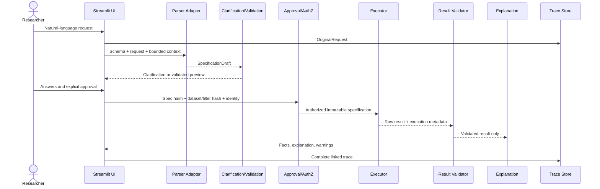

# Technical Design Document — ProfSur Guided Statistical Analysis

**Harness:** KAIF agentic-technical-design-harness v1.0.0  
**Date:** 2026-09-18  
**Slug:** `profsur-guided-statistical-analysis`  
**Status:** Implementation-ready design with identified approval blockers  
**Audience:** Product/PDM, statistical method owner, platform/application architects, AI/backend/data engineers, security, and operations  
**Authoritative upstream:** `04_KAIF_EXECUTIVE_HLD.md` and `05_HLD_TO_TDD_HANDOFF.yaml`  
**Source baseline:** ProfSur `fa97df7e1e6b43726c63590a47906d8ae8e5797d`

This is the authoritative next-level technical design for the bounded use case. It is not production code or a deployment manifest.

## 0. Hard boundaries

| Rule | Application |
|---|---|
| Sequence is not end state | Build a single vertical OLS/FE workflow first. Future agents/platforms require measured triggers and new approval. |
| Propose → approve → authorize → execute | LLM proposes; authenticated user approves; deterministic gate authorizes; bounded engine executes. |
| Ask, do not assume | Unknowns remain in the question register with labeled defaults and approvers. |
| Preserve requested specification | Normalization is visible; no method, variable, FE, cluster, filter, or missing-data substitution. |
| Fail closed | Schema, validation, authorization, execution, and result-validation failures block substantive explanation. |
| Read-only analysis | Initial slice computes and stores trace metadata; it does not mutate source panel data. |
| No platform inflation | No MCP, RAG, vector DB, long-term memory, multi-agent framework, or Kubernetes migration. |

## 1. Executive technical summary

The solution is a typed state machine embedded in the existing Streamlit/Cloud Run application. A schema-constrained call to ProfSur's current `gemini-2.5-flash` adapter drafts a `StatisticalSpecificationDraft`. Deterministic services resolve clarification, validate the active dataset, create an immutable `StatisticalSpecification`, bind explicit user approval to hashes, and authorize execution. A narrow adapter invokes existing OLS/fixed-effects functions. A result validator verifies requested-versus-executed fidelity and output integrity before a deterministic summary and optional bounded explanation are shown.

The first production-shaped slice supports:

- OLS with explicitly selected conventional or HC1 robust covariance;
- two-way fixed effects: company and year;
- one-way clustered covariance by company;
- plain dataset columns as dependent variable, predictors, and controls;
- complete-case analysis with disclosed exclusions;
- deterministic validation of variables, panel keys, sample, clusters, rank, collinearity/absorption, and output;
- explicit specification approval, warnings/errors, and trace export.

Minimum agency is **LLM-assisted workflow**. No agent runtime is selected. The current Google GenAI SDK remains behind an application adapter. The current Cloud Run container remains the deployment target. Rollback is a feature flag that disables the guided workflow and leaves existing direct journeys available.

## 2. Clarified requirements and open questions

### 2.1 Confirmed facts

| ID | Fact | Frozen source evidence |
|---|---|---|
| F-01 | ProfSur is a Streamlit application with AI Assistant and Stata Studio routes. | `app.py` |
| F-02 | Active panel rows expose company/year and corporate-finance variables. | `db.py:get_panel_data` |
| F-03 | `regress`, `xtreg`, `xtset`, alias resolution, factor expansion, unsupported responses, and result dictionaries exist. | `models/stata_engine.py` |
| F-04 | OLS and panel FE functions use statsmodels/linearmodels; clustered covariance exists. | `models/econometric.py` |
| F-05 | AI Assistant uses `gemini-2.5-flash`, function calling, and current chat/session persistence. | `models/llm_adapters.py`, `pages/19_ai_assistant.py`, `db.py` |
| F-06 | Provider-neutral validation records and derived fail-closed release status exist. | `models/validation_ledger.py` |
| F-07 | Application deploys as a Streamlit container to Cloud Run. | `Dockerfile`, `cloudbuild.yaml`, `.github/workflows/deploy.yml` |

### 2.2 Assumptions - planning defaults

| ID | Default | Approval needed |
|---|---|---|
| A-01 | Two-way FE means company effects and year effects. | Statistical method owner |
| A-02 | First slice permits company clustering only. | Statistical method owner |
| A-03 | Complete-case deletion; no imputation or automatic winsorization. | Method + data owners |
| A-04 | Plain columns only; no lags, transformations, interactions, or free-form factors. | Method owner |
| A-05 | Schema metadata and bounded results may reach model; raw panel rows do not. | Data + security/privacy owners |
| A-06 | Existing Cloud Run deployment and model adapter remain for pilot. | Operations, security/procurement, product |
| A-07 | Request-to-result state is retained according to a future approved retention policy. | Data/privacy owner |

### 2.3 Open questions

The complete register is `03_QUESTION_ASSUMPTION_REGISTER.md`. There is no whole-design blocker. Implementation cannot exit until the method owner approves method semantics, thresholds, variable roles, missingness, and collinearity policy. Production cannot release until provider/data policy, authorization roles, retention, accessibility, SLO, owners, and rollback are approved.

### 2.4 Closed design decisions

- One deterministic workflow; no autonomous agent.
- Existing statistical engine is reused through a new typed adapter.
- LLM output never becomes an executable command directly.
- User approval and deterministic authorization are mandatory.
- Results are explained only from a validated result contract.
- Cloud Run is retained; Kubernetes is rejected for current requirements.

## 3. Components and patterns

### 3.1 Agency ladder

| Option | Fit | Decision |
|---|---|---|
| Deterministic code only | Strong for forms, validation, execution, and explanations; weaker for flexible natural-language extraction | Required foundation and fallback |
| Workflow automation | Strong because stages and transitions are known and auditable | Selected control plane |
| LLM-assisted workflow | Adds natural-language extraction and optional prose without authority | Selected assistance level |
| Single autonomous agent | Adds dynamic planning/tool choice that this bounded flow does not need | Rejected |
| Multi-agent system | Adds routing, handoffs, failure modes, cost, and evaluation surface without distinct independent domains | Rejected |

### 3.2 Component boundaries

| Component | Responsibility | Input/output | Authority |
|---|---|---|---|
| Guided Analysis UI | Request, clarification, preview, approval, status, result, trace | User events ↔ service calls | No statistical authority |
| Request Capture | Immutable original request/context and IDs | UI context → `OriginalRequest` | System record authority |
| Parser Adapter | One schema-constrained model call | `ParserContext` → `StatisticalSpecificationDraft` | Proposal only |
| Clarification Engine | State transitions and targeted questions | Draft + catalog/policy → question or candidate spec | Deterministic |
| Specification Validator | Method/data/panel/sample/covariance checks | Candidate + active data profile → validated spec/errors/warnings | Deterministic |
| Approval Service | Review diff and signature | Valid spec + user → `Approval` | User decision, system-enforced |
| Authorization Gate | Permission, support, hash, idempotency checks | Approval + current context → `AuthorizationDecision` | Deterministic final authorizer |
| Executor Adapter | Convert typed spec to engine call | Authorized spec → raw execution result | Execute only |
| Result Validator | Fidelity, invariants, warnings, release status | Spec + raw result → `ValidatedResult` | Deterministic |
| Explanation Composer | Deterministic facts plus optional bounded prose | Validated result → `Explanation` | No execution authority |
| Trace Repository | Linked records/events/export | All contracts/events | Audit source of truth |
| Telemetry Adapter | Metrics/logs/traces with redaction | Events → approved backend | Observability only |

### 3.3 State machine

```text
CAPTURED → DRAFTED → NEEDS_CLARIFICATION ↔ DRAFTED
  → VALIDATION_FAILED (recoverable to DRAFTED)
  → READY_FOR_REVIEW → APPROVED → AUTHORIZED → RUNNING
  → EXECUTION_FAILED (safe retry only)
  → RESULT_VALIDATION_FAILED (no explanation)
  → VALIDATED → EXPLAINED → COMPLETED

Any spec, dataset, or filter change after APPROVED:
APPROVAL_INVALIDATED → READY_FOR_REVIEW.
```

Transitions are append-only audit events. Only allowlisted transitions are accepted. Retries cannot skip validation or approval.

### 3.4 Request flow



### 3.5 Sliced MVP and exit gates

| Slice | In scope | Out of scope | Exit gates |
|---|---|---|---|
| S0 Contracts/policy | Schemas, capability matrix, state/error taxonomy, variable catalog interface, fixtures | UI/model/execution | Schema validation; owner approval; contract tests 100% |
| S1 Vertical tracer | Explicit and one ambiguous OLS/FE path, company/year FE, company cluster, preview/approval, execute/validate/explain/trace | Broader aliases, operational hardening | Critical gates pass; fidelity/trace 100%; statistical parity accepted |
| S2 Coverage/hardening | Full initial scenario matrix, accessibility, model fallback, observability, recovery, security controls | New methods | Acceptance thresholds met; no critical regression; runbook/rollback approved |
| S3 Production pilot | Feature-flagged cohort, canary dashboards, reviewer workflow | General availability | Pilot targets met for two windows; owners sign production decision |
| S4 Convergence, optional | Shared contract for direct Stata path | Method expansion | New approval and parity suite |

### 3.6 Evolve triggers

- Introduce a graph/workflow framework only if this state machine cannot remain clear/testable in current application patterns or durable recovery is required across services.
- Introduce a single autonomous agent only if approved future work requires dynamic multi-step planning with a changing tool set that this typed workflow cannot express.
- Introduce multi-agent only with at least two independently governed specialist domains and routing/tool-selection errors above an approved threshold for two consecutive evaluation windows after deterministic grouping improvements.
- Introduce Kubernetes only if measured scale, workload isolation, organizational platform mandate, specialized scheduling, or multi-service resilience cannot be satisfied by Cloud Run.

### 3.7 Prompt governance

| Pack | Contents | Owner | Change cadence | Promotion |
|---|---|---|---|---|
| `spec-parser-v1` | Instruction, JSON schema, field descriptions, examples, ambiguity policy | AI engineer; method-owner approval | Approved release | Full parser/clarification suite; no critical regression |
| `result-explainer-v1` | Allowed facts, wording policy, prohibitions, examples | AI engineer; method-owner approval | Approved release | Exact-number, warnings, limitations, causal-language suite |

Store version, content hash, model ID, SDK version, temperature, and evaluation-run ID. Console-only edits are prohibited for production.

## 4. Model selection

### 4.1 Selected model strategy

| Component | Model/API ID | Use | Why | Cost verified 2026-09-18 | Alternate |
|---|---|---|---|---|---|
| Specification parser | Google Gemini `gemini-2.5-flash` | Schema-constrained extraction/uncertainty | Already integrated; supports structured output/function calling; low-latency positioning | Official standard paid price: $0.30/M text/image/video input tokens and $2.50/M output tokens | Deterministic manual form |
| Explanation refinement | Google Gemini `gemini-2.5-flash` | Optional prose over validated facts | Reuses adapter; no second provider needed | Same as above | Deterministic explanation template |
| Statistical execution | No LLM | OLS/FE computation | Numerical authority remains deterministic | Not token-priced | Existing bounded Python engine |
| Authorization/result validation | No LLM | Policy/invariants | Must be exact, reproducible, fail closed | Not token-priced | None |

Provider approval is pending. Existing Claude/Ollama routes are excluded from this slice; a model router adds evaluation and operational scope. Local LLMs are prohibited by ProfSur directives.

### 4.2 Routing and budgets

- Parser: one initial call and at most one schema-repair retry; then deterministic form.
- Clarification: deterministic question selection, not an open model interview loop.
- Explanation: deterministic template always available; at most one optional model call after validation.
- Token budgets and monetary caps are `UNKNOWN`; instrument first. No uncapped loops.
- Temperature planning default: 0.0–0.1, versioned and evaluated.
- No cross-user cache unless permissions, hashes, and retention policy explicitly allow it.

### 4.3 Model contract

Parser input is limited to request text, active panel/filter labels, capability matrix, variable names/descriptions/units/role constraints, and JSON schema. Output is draft schema only, with `additionalProperties=false`. Unknown enums fail.

The explainer receives only the validated result plus approved wording rules, with no tools. Exact-number, required-warning, and prohibited-causal-language checks run before display. The deterministic summary remains authoritative.

## 5. Tool boundaries and interfaces

### 5.1 Tool inventory

| Consumer | Interface | Operation | Auth scope | Notes |
|---|---|---|---|---|
| UI/service | Active dataset schema/profile API | Read | Current user's dataset context | Metadata/counts, not unrestricted SQL |
| Validator | Variable catalog and capability policy | Read | Application service | Versioned deterministic configuration |
| Executor adapter | `execute_approved_specification` | Read-only analysis | Valid authorization required | OLS/FE enum only; no raw command |
| Trace service | Append record/event | Write trace metadata | User/session-scoped service | No model credentials |
| Export service | Fetch trace bundle | Read | Owner/reviewer role | Redaction/retention applied |

### 5.2 REST/API vs MCP

Use in-process typed Python interfaces. An internal REST split is unnecessary until component isolation/scaling requires it. MCP is deferred because there is one bounded executor and no cross-product tool ecosystem. Future MCP requires gateway RBAC, workload identity/mTLS, strict schemas, audit, and the same authorization gate.

### 5.3 Executor boundary

The executor never accepts model text or arbitrary Stata/Python/SQL. It accepts an `AuthorizedExecutionRequest` with immutable specification, approval, authorization, idempotency key, and fingerprints. The adapter maps fields to library calls and creates a canonical command representation for reproducibility.

## 6. Data and state contracts

### 6.1 Core contracts

`OriginalRequest` contains request/user/session IDs, exact text, capture time, panel mode, filters, and dataset/filter fingerprints.

`StatisticalSpecificationDraft` contains method, dependent variable, predictors, controls, company/year FE flags, entity/time variables, covariance/cluster, sample filters, missing-data policy, unresolved fields, ambiguities, and parser metadata.

`StatisticalSpecification` adds normalized names, schema/policy/catalog versions, reproducible representation, preflight profile, errors, warnings, and specification hash. It is valid only with no blocking errors or unresolved fields.

`Approval` binds authenticated user/role, specification hash, dataset/filter hashes, warning acknowledgements, timestamp, and decision.

`AuthorizationDecision` independently checks permission, hashes, capability support, zero blockers, warning acknowledgement, expiry/reuse policy, and idempotency. Allow returns a short-lived execution token bound to hashes.

### 6.2 Statistical specification contract

```yaml
schema_version: "1.0"
method: "ols | fixed_effects"
dependent_variable: string
predictors: [string]
controls: [string]
fixed_effects: {company: boolean, year: boolean}
panel: {entity_variable: string, time_variable: string}
covariance:
  type: "conventional | hc1 | clustered"
  cluster_variables: [string]
sample: {panel_mode: string, filters: object}
missing_data_policy: "complete_case"
catalog_version: string
policy_version: string
dataset_fingerprint: sha256
filter_fingerprint: sha256
specification_hash: sha256
```

### 6.3 Execution result contract

```yaml
execution_id: uuid
request_id: uuid
specification_hash: sha256
authorization_id: uuid
status: "success | error"
capability_id: "ols_v1 | twoway_fe_company_cluster_v1"
estimator: string
covariance: object
effects: {company: boolean, year: boolean}
sample:
  rows_input: integer
  rows_complete: integer
  rows_used: integer
  entities: integer
  periods: integer
  clusters: integer
  excluded_by_variable: object
coefficients:
  - variable: string
    estimate: number
    standard_error: number
    statistic: number
    p_value: number
    confidence_interval_95: [number, number]
diagnostics: object
omitted_terms: [{variable: string, reason: string}]
warnings: [{code: string, severity: string, message: string}]
engine_version: string
code_revision: string
dataset_fingerprint: sha256
sample_fingerprint: sha256
started_at: datetime
completed_at: datetime
```

### 6.4 Error contract

Every error has `error_id`, stable `code`, stage, severity, optional field, plain-language message, recovery action, retryability, trace ID, and redacted details. Codes include `AMBIGUOUS_VARIABLE`, `VARIABLE_NOT_FOUND`, `DUPLICATE_ROLE`, `UNSUPPORTED_METHOD`, `UNSUPPORTED_OPTION`, `PANEL_KEY_INVALID`, `CLUSTER_INVALID`, `INSUFFICIENT_SAMPLE`, `INSUFFICIENT_CLUSTERS`, `MISSINGNESS_REVIEW_REQUIRED`, `COLLINEARITY_REVIEW_REQUIRED`, `APPROVAL_REQUIRED`, `APPROVAL_STALE`, `AUTHORIZATION_DENIED`, `EXECUTION_FAILURE`, `RESULT_FIDELITY_FAILURE`, `RESULT_INVALID`, `EXPLANATION_POLICY_FAILURE`, and `PROVIDER_UNAVAILABLE`.

### 6.5 Trace contract

Trace IDs link all contracts and state transitions. Original requests and revisions are append-only. Hashes protect integrity and reproducibility. Retention/access are policy-controlled. Export includes human-readable summary, canonical JSON, generated command, versions, warnings, and evidence references.

## 7. Deterministic validation design

### 7.1 Capability matrix

| Capability | OLS v1 | Two-way FE v1 |
|---|---|---|
| Variables | Plain numeric columns | Plain numeric columns |
| Company FE | False | True |
| Year FE | False | True |
| Covariance | Conventional or HC1, explicit | Company-clustered |
| Cluster | None | `company_code` only |
| Missing data | Complete-case, disclosed | Complete-case, disclosed |
| Transformations/lags/interactions | Unsupported | Unsupported |

### 7.2 Preflight checks

1. Schema/enums; no extra fields.
2. Supported method/option combination.
3. Exact variable resolution against catalog and active columns.
4. DV exists, numeric, nonconstant, and not duplicated in other roles.
5. Predictors/controls exist, numeric, nonconstant, and nonduplicated.
6. Panel keys exist, have valid types, and entity-time pairs are unique.
7. Requested FE variables exist and vary.
8. Cluster exists and approved count/size policy passes.
9. Complete-case input/used counts and per-variable exclusions are reported.
10. Minimum observations/entities/periods/clusters pass.
11. Design matrix rank and perfect collinearity/absorption preflight.
12. Canonical executor request round-trips to normalized spec.

No automatic replacement, imputation, winsorization, method selection, covariance downgrade, or FE removal.

### 7.3 Result validation

- Authorization/spec/dataset/filter hashes match.
- Engine reports requested estimator, effects, and covariance.
- Rows used match independently derived sample accounting.
- Entities/periods/clusters match approved profile.
- Estimates, standard errors, statistics, p-values, intervals, and diagnostics are finite and structurally valid.
- Requested variables are retained or explicitly omitted with reason.
- Critical omissions/rank failures derive `NOT_VALIDATED`.
- Required warnings and severities are complete.
- Frozen fixture parity is within method-owner-approved tolerance.
- Validation status derives from numerical, assumption, methodological, reproducibility, and reviewer gates; callers cannot set `VALIDATED`.

## 8. Explanation and presentation behavior

### 8.1 Deterministic result summary

Always show exact specification/command; input/used/excluded sample; estimator, FE, covariance/cluster; coefficient, SE, 95% interval, p-value, and units; omissions; diagnostics; warnings/limitations; and trace/export.

### 8.2 Responsible explanation policy

- Use “associated with,” “conditional association,” or “within-company association.”
- Never infer causality, policy effectiveness, or counterfactual outcomes.
- Explain magnitude/unit before significance.
- Do not equate p<0.05 with importance or a large p-value with a true null.
- Identify company/year effects and clustering in plain language.
- State sample and missing-data policy.
- State remaining time-varying confounding and misspecification limits.
- Introduce no numbers, variables, literature, or diagnostics absent from validated output.

### 8.3 User-visible statuses and accessibility

Clarification uses neutral question cards. Blocking errors use stable codes, affected fields, and recovery actions. Warnings have explicit severity and consequence. Review shows a full specification diff and unselected approval action. Failures receive no substantive interpretation. Validated results retain visible warnings and trace.

Do not rely on color alone. Move focus to the first error/question, preserve entered values, support keyboard activation, provide accessible names/descriptions, and make tables screen-reader usable. Planning target: WCAG 2.2 AA, pending approval.

## 9. Memory and context management

| Plane | Content | Store | Retention |
|---|---|---|---|
| Knowledge/config | Variable catalog, capability matrix, schemas, explanation policy | Git-tracked configuration/code | Version history |
| Episodic LTM | Not required | None | None |
| Procedural | Prompt packs and deterministic rules | Git-tracked/versioned | Release history |
| Audit | Linked contracts/events/hashes | Additive existing DB extension or approved store | `UNKNOWN`; privacy approval required |

Context is selective, explicit, structured, and request-scoped. Never silently truncate original request, specification, approval, or critical warnings. Limit chat history; represent clarification as fields/answers. Record prompt/context hashes and token counts. Redact before provider calls/logs.

## 10. Value and technical KPIs

| KPI | Type | Measurement | Owner |
|---|---|---|---|
| Time to approved spec | Business/process | Request to approval | Product |
| Approved-result completion | Business/process | Validated completions / approved supported requests | Product/operations |
| Avoidable rerun rate | Business/process | Trace taxonomy | Product/method owner |
| Method selection accuracy | Quality | Exact golden-set match | AI/method owner |
| Variable-role accuracy | Quality | Exact field match | AI/method owner |
| Clarification precision/recall | Quality | Required questions vs actual | Product/method owner |
| Tool recall | Technical | Required executor call / executable cases | AI/engineering |
| Parameter accuracy | Technical | Exact executor parameters / expected | AI/engineering/method owner |
| Spec-to-execution fidelity | Safety | Contract/hash equivalence | Engineering |
| Statistical parity | Statistical | Reference/tolerance comparison | Method owner |
| Warning accuracy | Safety | Required visible warnings | Method owner/product |
| Explanation correctness | Quality | Exact facts + human rubric | Method owner |
| p95 stage latency | Reliability | Traces | Operations |
| Model tokens/cost | Cost | Usage per request | Product/operations |
| Trace completeness | Audit | Required fields/events | Engineering/security |

## 11. Observability

Use OpenTelemetry-compatible correlation where available. Capture stage timings, parser versions/tokens/schema status, clarification reasons, validation rule results, approval/invalidation, executor capability/version/sample/status, result gates, explanation policy checks, cost, and trace completeness. Do not put raw prompts or rows in metric labels/logs; content sampling requires explicit policy.

Alert immediately on authorization bypass, approved/executed mismatch, critical result-validation failure, redaction/trace-integrity failure, critical warning omission, or policy-check failure. Set rate/latency/cost alerts after baselines and SLO/budget approval.

## 12. Evaluation

### 12.1 Suites

Parser contracts; ambiguity/clarification; invalid variable/role/panel/cluster/sample; unsupported substitution; OLS/HC1/two-way-FE/company-cluster fixtures; missingness/constants/rank/collinearity/absorption/low clusters; authz/stale approval/idempotency/tamper; provider/executor/storage failure; explanation exactness/uncertainty/warnings/causality; accessibility/status/recovery.

### 12.2 Gates

| Metric | Gate |
|---|---|
| Explicit method accuracy | 100% |
| Overall method accuracy | ≥98% |
| DV accuracy on critical suite | 100% |
| Overall variable-role accuracy | ≥98% |
| Clarification recall | ≥98%; critical misses 0 |
| Clarification precision | ≥90% |
| Tool recall | ≥99% on approved executable cases |
| Executor parameter accuracy | 100% for method/DV/FE/cluster; ≥99% all fields |
| Unsupported substitution | 0 |
| Authorization bypass/stale execution | 0 |
| Statistical parity | Approved tolerance; structural fields exact |
| Critical warning omission | 0 |
| Explanation exact-number fidelity | 100% critical fields |
| Unsupported causal claim | 0 |
| Trace completeness | 100% |

Planning defaults require owner approval. Partial critical gates fail release. Method owner reviews fixtures, warning severity, and stratified explanations; Product/accessibility reviews UX; Security reviews adversarial/redaction cases. Judge-model scoring, if used, is secondary and calibrated to human labels.

## 13. Continuous improvement

| Loop | Trigger | Action | Owner | Kill switch |
|---|---|---|---|---|
| Parser correction | User corrects field | Privacy-reviewed case enters candidate eval set; update catalog/prompt/rules | AI + method owner | Manual form |
| Warning policy | Reviewer changes severity | Version policy; rerun affected suites | Method owner | Prior policy |
| Prompt/model change | New version/provider | Full offline regression and canary | AI/product | Pin prior version |
| Engine change | Dependency/code/spec change | Parity suite and contract review | Statistical engineering | Disable capability |
| Cost/latency | Budget/SLO breach | Reduce context; deterministic explanation; limits | Product/operations | Disable optional explanation |
| Incident | Fidelity/privacy/bypass | Disable guided execution; preserve evidence; review | Operations/security | Feature flag |

No silent autonomy promotion. Automatic execution would be a separate approved epic.

## 14. Guardrails and HITL

| Mode | Behavior | Use |
|---|---|---|
| Manual | Deterministic form | Required fallback |
| Ask | Model drafts; system clarifies; user approves | Default |
| Agent | Model executes without per-run approval | Prohibited |

Controls are layered across approved configuration, input/schema/data minimization, deterministic pre-execution validation/approval/authz, bounded runtime/idempotency/timeouts, post-execution fidelity/result/explanation checks, and operational alerts/canary/rollback.

Human risks: mitigate automation bias with visible uncertainty/diff and unselected approval; alert fatigue with severity/actionability; skill decay with command/spec export and manual path; misaligned incentives by placing quality gates above adoption; rubber-stamping with highlighted material changes and sampled review.

## 15. Identity and access

| Actor | Read | Propose | Authorize | Execute | Escalate | Notify |
|---|---|---|---|---|---|---|
| Researcher | Own/current context and traces | Yes | Approves own spec, not policy | No direct credential | Yes | Receives |
| Viewer | Permitted published results | No | No | No | Yes | Allowed notices |
| Parser/explainer model | Supplied bounded context | Draft/text only | Never | Never | Suggest only | No |
| Validator | Schema/catalog/profile | Validated candidate | No | No | Yes | Status |
| Authorization gate | Approval/policy/hashes | No | Yes, deterministic | No | Deny/escalate | Decision |
| Executor | Authorized spec only | No | No | Yes if authorized | Failure | Result |
| Statistical reviewer | Assigned traces/results | Recommendations | Policy/review as assigned | No | Yes | Receives |
| Operations | Operational metadata | No | Deployment/rollback only | No statistical execution | Yes | Alerts |

Use existing authenticated user/session. App-to-dataset is read-only. App-to-provider uses approved secrets. Authorization-to-executor uses a short-lived decision bound to hashes. Static model-held write credentials are prohibited.

## 16. Framework and deployment choices

### 16.1 Workflow framework

Existing application code/state machine is selected. LangGraph is deferred; agent SDKs/CrewAI/AutoGen/custom multi-agent are rejected. The Google GenAI SDK is a model client, not workflow authority.

### 16.2 Deployment comparison

| Option | Fit | Decision |
|---|---|---|
| Current Streamlit container on Cloud Run | Current path, managed scaling, lowest change | Selected |
| VM | More operations without benefit | Rejected |
| Additional managed services | Only for approved durable audit/telemetry needs | Conditional |
| Other managed container platform | No current advantage | Rejected |
| Kubernetes | No evidenced scale/isolation/platform need | Rejected for slice |

Cloud Run design: one existing service revision, feature flag, additive migrations, conservative measured concurrency, bounded time/resources, maximum-instance protection after capacity measurement, revision/feature rollback. Health is operational evidence only, never statistical/UI acceptance evidence.

If future evidence requires Kubernetes, candidate workloads are UI/API, executor, policy gate, and telemetry collector with separate identities, NetworkPolicies, HPA, PDB, circuit breakers, and managed stores. This is a future comparison, not a build instruction. Trigger: platform mandate or measured requirements unmet by Cloud Run.

## 17. Security, privacy, rollback, and cost

Threats include prompt injection, authorization bypass, stale approval/replay, arbitrary execution, data leakage, trace tampering, and output overtrust. Treat user/model text as untrusted; enforce server-side schema/enums; bind approvals/tokens to identity/hashes/expiry/idempotency; restrict trace access; redact payloads; bound executor resources; and define provider/database/partial-write recovery.

Data classification, region, retention, erasure, and provider terms are production-blocking `UNKNOWN`s. Default: schema metadata and validated aggregate/result fields only; no raw records or direct identifiers.

Rollback: disable feature flag, stop new executions, pin prior prompt/policy/model adapter or application revision, preserve evidence, rerun regression suite, reopen only with approval. Additive storage changes are not destructively removed.

Cost lines are model tokens, Cloud Run CPU/memory, trace storage, human review, and engineering/operations. Measure before estimating totals. No ROI claim is made.

## 18. Decision register

| Decision | Chosen | Alternatives | Reason | Revisit trigger |
|---|---|---|---|---|
| Agency | LLM-assisted workflow | Code-only, agents | Language convenience with exact control | Proven dynamic-planning need |
| Execution | Typed authorized spec | Raw command/tool call | Prevent model-controlled execution | Safety invariant |
| Methods | OLS + two-way FE/company cluster | Broad command set | Bounded useful slice | New contract approved |
| Explanation | Facts + optional bounded prose | Free-form; template only | Accuracy and usability | Eval/cost failure |
| Model | Existing Gemini for pilot | Router/new/Claude/local | Reuse/minimal surface | Approval/performance/cost |
| Tools | In-process typed APIs | MCP/arbitrary tools | One bounded application | Shared tool ecosystem needed |
| Memory | Request/session trace | LTM/RAG/GraphRAG | No retrieval need | New knowledge use case |
| Framework | Existing state machine | LangGraph/agent SDK | Few deterministic stages | Durable distributed graph needed |
| Deployment | Cloud Run | VM/Kubernetes | Current fit/lowest change | Unmet measured requirements |
| Rollback | Feature flag + prior revision | Destructive rollback | Fast/recoverable | Policy change |

## 19. References and evidence

| Decision/claim | Type | Source |
|---|---|---|
| Minimum agency and parsimony | Secondary | Michael Albada, *Building Applications with AI Agents*, Chapters 1–2 and 8; https://www.oreilly.com/library/view/building-applications-with/9781098176495/ |
| Tools, memory, evaluation, protection, HITL | Secondary | Same title, Chapters 4, 6, 9, 12–13; https://github.com/michaelalbada/BuildingApplicationsWithAIAgents |
| Gemini model capability | Primary | https://ai.google.dev/gemini-api/docs/models/gemini-2.5-flash |
| Gemini pricing | Primary | https://ai.google.dev/gemini-api/docs/pricing |
| Structured outputs | Primary | https://ai.google.dev/gemini-api/docs/structured-output |
| Function calling/application execution separation | Primary | https://ai.google.dev/gemini-api/docs/generate-content/function-calling |
| PanelOLS company/time effects and rank | Primary | https://bashtage.github.io/linearmodels/panel/panel/linearmodels.panel.model.PanelOLS.html |
| Clustered covariance | Primary | https://bashtage.github.io/linearmodels/panel/panel/linearmodels.panel.model.PanelOLS.fit.html |
| p-value interpretation limits | Primary | https://www.amstat.org/asa/files/pdfs/P-ValueStatement.pdf |
| GenAI risk lifecycle | Primary | https://nvlpubs.nist.gov/nistpubs/ai/NIST.AI.600-1.pdf |
| Prompt injection | Primary | https://owasp.org/www-project-top-10-for-large-language-model-applications/ |
| Telemetry conventions | Primary | https://opentelemetry.io/docs/specs/semconv/ |
| Cloud Run autoscaling/concurrency | Primary | https://docs.cloud.google.com/run/docs/about-instance-autoscaling and https://docs.cloud.google.com/run/docs/about-concurrency |

## Appendix A — HLD to TDD map

| HLD | TDD |
|---|---|
| Flow/operating model | §§3, 7–8 |
| Agency/deployment | §§3.1, 16 |
| Contracts | §6 |
| Model/tools/memory | §§4–5, 9 |
| Security/guardrails | §§14–17 |
| Evaluation/KPIs/observability | §§10–13 |
| Delivery | §3.5 and Appendix B |

## Appendix B — implementation build order

1. Approve S0 contracts, capability matrix, thresholds, variable catalog, and errors.
2. Add contract models and pure validation/state-transition tests.
3. Add preflight and executor adapter to existing OLS/FE functions.
4. Add approval/authz/hash/idempotency and trace persistence.
5. Build clarification/review UI behind disabled feature flag.
6. Add schema-constrained parser and deterministic form fallback.
7. Add result validator and deterministic summary.
8. Add optional bounded explanation and policy checks.
9. Add telemetry, accessibility, recovery, export, and runbook.
10. Run acceptance suite and controlled pilot; promote only on approved gates.

## Appendix C — alignment note

The HLD and TDD agree on a deterministic workflow and bounded first slice. KAIF's generic Kubernetes-oriented checklist is represented as a comparison and future trigger, not a Day-1 mandate. Planning defaults remain pending rather than silently resolved.
