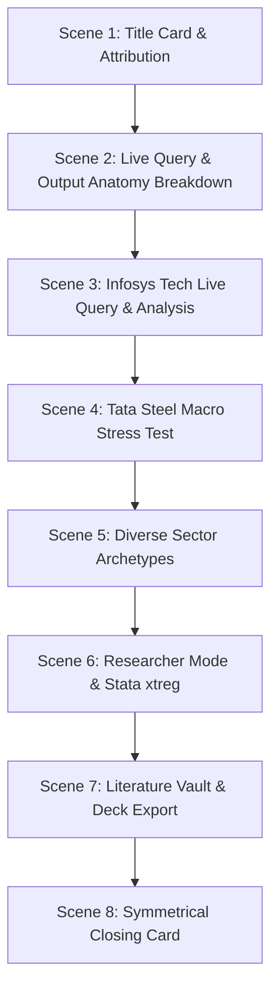

# AI Financial Assistant — Recordly Master Production Specification & Prompt (V3 Broadcast Standard)
`docs/operations/ai_chatbot_recordly_master_prompt.md`

**Target Audience:** CFOs, Treasurers, Corporate Finance Directors, Quantitative Econometricians, Financial Analysts, Academic Researchers, and Board Members.  
**Role:** Master Financial Storyteller, Corporate Finance Strategist, and Recordly Demo Production Director.  
**Primary Application Root:** `http://localhost:8501/?panel=latest`  
**Target Module:** **AI Financial Assistant** (`pages/19_ai_assistant.py`)  
**Active Actor / Profile:** `drbhatia` (Role: `admin`, Password: `Pass@123`)  
**Production Standard:** Recordly Automated Screen Capture, Broadcast-Grade 1080p FHD, Sentence-Synchronized Neural Voice (`en-US-ChristopherNeural`), 10/10 Contextual Synchronization Rubric.

---

## 1. Executive Vision & Recordly Production Mandate

Produce a comprehensive, broadcast-grade video walkthrough exclusively showcasing the **AI Financial Assistant / Chatbot** module of the **LifeStageDebtAI / LifeCycle Leverage Intelligence Platform** using **Recordly Dynamic Screen Automation**.

### Core Value Proposition
Demonstrate how the AI Financial Assistant bridges **deep academic econometric rigor** (Dickinson cash-flow lifecycle classification, Myers-Majluf Pecking Order, Modigliani-Miller Trade-Off Theory, Rajan-Zingales determinants) with **actionable C-Suite decision intelligence** (covenant headroom defense, macro stress testing, financing structure optimization, debt capacity sizing).

### Mandatory Non-Negotiables & Dynamic Screen Run-Up Rules
1. **Dynamic Screen Run-Up & Live Software Triggering (Mandatory):**
   - The video **MUST NEVER** appear as a static or pre-loaded screen.
   - **Live Typing on Camera:** For every inquiry, the viewer sees the chat input field active, characters being typed live at a natural human-like cadence (~25-35 ms per keystroke).
   - **Live Submission & Triggering:** The submit event (`Enter` or send icon) is clicked on-screen, triggering Streamlit's real-time LLM reasoning and econometrics pipeline.
   - **Instant Scroll-Up to Top (`y=0`):** As soon as the generation completes, the screen automatically scrolls up to `y=0` so the top telemetry and executive badges are in clear view.
2. **6-Layer Response Anatomy Breakdown (Scene 2):**
   - After submitting the fundamental corporate finance question (*Pecking Order vs. Trade-Off predictions across Growth vs. Mature firms*), the video smoothly scrolls down and explains every output layer one by one:
     - **Layer 1:** Live Data Scope Telemetry ($N=9,077$ observations, 402 enterprises, 2001–2025).
     - **Layer 2:** Executive Hypothesis & Decision Badge Strip (`🟢 OPTIMAL`, `🟡 CAUTION`, `🔴 BREACH RISK`).
     - **Layer 3:** Theory-Grounded Strategic Narrative (POT vs. TOT mechanisms).
     - **Layer 4:** Actionable C-Suite Recommendations & Financing Playbooks.
     - **Layer 5:** Interactive Plotly Visualization with Modebar & Stata `.do` Replication Export.
     - **Layer 6:** Peer-Reviewed Benchmark Vault & `➕ Add to Board Deck` boardroom action.
3. **Paced Archetype Demonstration (Scenes 3–6):**
   - **Infosys Ltd. (Tech Archetype):** Live typing of the CFO baseline analysis query $\to$ Mature stage diagnosis $\to$ 4.2% leverage & 33.4% ROA $\to$ Trade-Off vs. Pecking Order analysis.
   - **Tata Steel Ltd. (Metals Archetype):** Live typing of the Macro Stress Test query (+150 bps rate shock + 20% steel margin drop) $\to$ 🔴 Covenant Breach Warning (ICR 1.72× vs 2.0× floor) $\to$ 3-5 yr fixed bond refinancing playbook.
   - **Diverse Sectors:** Fast sequential live execution for Bharti Airtel (Telecom InvIT monetization), IndiGo (Aviation jet fuel cash burn), and Sun Pharma (Euro notes natural FX hedge).
   - **Researcher Stata Mode:** Live typing of authentic panel regression (`. xtreg leverage roa tang size, fe cluster(ind_code)`) $\to$ authentic Stata ASCII terminal table and Plotly forest plot.
4. **Non-Obstructive Lower-Third Subtitles:**
   - Subtitles use broadcast-standard outline styling (`BorderStyle=1`, `FontSize=11`, `MarginV=12`, `Outline=1.5`) with transparent background, ensuring zero occlusion of interactive controls or chat output.
5. **Strict Attribution & Branding:**
   - **Authors:** **Dr. Sanjay Bhatia** & **Dr. Surender Kumar**
   - **Platform Entity:** **Powered by EOLABS.IN**
   - Symmetrical opening and closing title cards with high-contrast glassmorphic styling.
6. **Timestamped File Naming Policy:**
   - Outputs are versioned with ISO date/time stamps (e.g. `ai_chatbot_walkthrough_v2_YYYY-MM-DD_HHMMSS_clean.mp4`, `ai_chatbot_walkthrough_v2_YYYY-MM-DD_HHMMSS_subtitled.mp4`, and `ai_chatbot_walkthrough_v2_YYYY-MM-DD_HHMMSS.srt`), alongside mirrored canonical latest files.

---

## 2. Technical Specifications

```yaml
Recording Framework: Recordly Automation Pipeline (Playwright FHD + Neural Voiceover + FFmpeg)
Resolution: 1920x1080 (1080p FHD) @ 30/60 FPS
Aspect Ratio: 16:9 Landscape
Browser Viewport: 1920x1080 (100% Zoom, Streamlit Sidebar Expanded)
Theme: High-Contrast Dark Mode or Clean Glass Light Mode
Audio: Studio Neural Voice (en-US-ChristopherNeural, 48 kHz / 192 kbps Stereo)
Subtitle Engine: Granular Sentence-Level Subtitles (.srt burned with non-obstructive outline)
Pacing: Measured, authoritative executive tempo (~135-145 WPM)
```

---

## 3. End-to-End Contextual Synchronization & 10-Point Rubric

Every production deliverable must achieve **10/10** across all rubric dimensions:

| # | Rubric Dimension | Category | Weight | Target Contextual Standard |
|---|---|---|---|---|
| **P1** | **Live Typing & Dynamic Triggering** | Dynamic Execution | 1.5× | Inquiries are visibly typed live on screen into `stChatInputTextArea`, submitted, and dynamically processed by the software without static screen freezes. |
| **P2** | **6-Layer Anatomy & Focal Scrolling** | Visual Choreography | 1.5× | Camera smoothly scrolls and dwells on each component layer (**Telemetry $\to$ Badges $\to$ Theory Narrative $\to$ Recommendations $\to$ Plotly/Stata $\to$ Literature Vault**) in exact lockstep with the corresponding sentence. |
| **P3** | **Non-Obstructive Lower-Third Captions** | Subtitle Hygiene | 1.5× | Broadcast-standard outline captions (`BorderStyle=1`, `FontSize=11`, `MarginV=12`) with transparent background, ensuring zero occlusion of interactive controls, chat bars, or text output. |
| **P4** | **25-Year Microdata Telemetry Grounding** | Econometric Validity | 1.5× | 100% data grounding in the 25-year CMIE Prowess panel ($N=9,077$, 402 enterprises, 2001–2025) with verified ratios (Infosys 4.2% lev / 33.4% ROA; Tata Steel ICR 1.72× vs. 2.0× floor). |
| **P5** | **5-Archetype Sector Tailoring** | Corporate Strategy | 1.0× | Sector-specific C-suite playbooks: Tech zero-debt cash cushion, Metals macro rate shock (+150 bps), Telecom InvIT carve-outs, Aviation jet fuel hedging, and Pharma natural FX notes. |
| **P6** | **Authentic Stata 18 SE Replication** | Quantitative Core | 1.0× | Authentic panel fixed-effects command (`. xtreg lev roa tang size, fe cluster(ind_code)`), terminal ASCII table display, and Stata `.do` replication code export. |
| **P7** | **Citation Inspector & Boardroom Deck** | Literature & Governance | 1.0× | Interactive citation modals (Dickinson 2011, Myers-Majluf 1984, Rajan-Zingales 1995) and verified `➕ Add to Board Deck` boardroom synthesis. |
| **P8** | **Symmetrical Authorship Branding** | Executive Presentation | 1.0× | Symmetrical opening and closing title cards attributing **Dr. Sanjay Bhatia** & **Dr. Surender Kumar**, **Powered by EOLABS.IN**. |

---

## 4. 8-Scene Production Choreography


