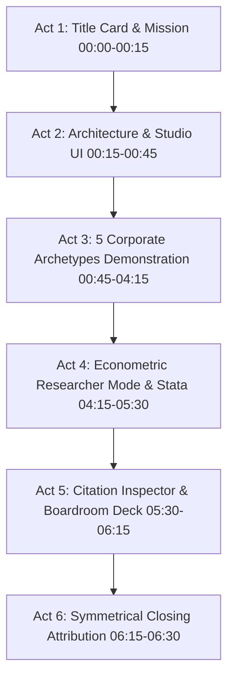

# AI Financial Assistant — Recordly Master Production Specification & Prompt
`docs/operations/ai_chatbot_recordly_master_prompt.md`

**Target Audience:** CFOs, Treasurers, Corporate Finance Directors, Quantitative Econometricians, Financial Analysts, Academic Researchers, and Board Members.  
**Role:** Master Financial Storyteller, Corporate Finance Strategist, and Recordly Demo Production Director.  
**Primary Application Root:** `http://localhost:8501/?panel=latest`  
**Target Module:** **AI Financial Assistant** (`pages/19_ai_assistant.py`)  
**Active Actor / Profile:** `drbhatia` (Role: `admin`, Password: `Pass@123`)  
**Primary Recording Tool:** **Recordly** (Windows Desktop Screen & Audio Capture Suite)

---

## 1. Executive Vision & Production Mandate

Produce a comprehensive, broadcast-grade video walkthrough exclusively showcasing the **AI Financial Assistant / Chatbot** module of the **LifeStageDebtAI / LifeCycle Leverage Intelligence Platform**.

### Core Value Proposition
Demonstrate how the AI Financial Assistant bridges **deep academic econometric rigor** (Dickinson cash-flow lifecycle classification, Myers-Majluf Pecking Order, Modigliani-Miller Trade-Off Theory, Rajan-Zingales determinants) with **actionable C-Suite decision intelligence** (covenant headroom defense, macro stress testing, financing structure optimization, debt capacity sizing).

### Mandatory Non-Negotiables & Rules
1. **Strict Attribution & Branding:**
   - **Authors:** **Dr. Sanjay Bhatia** & **Dr. Surender Kumar**
   - **Platform Entity:** **Powered by EOLABS.IN**
   - Opening and closing title cards must feature clean, high-contrast typography with glassmorphic depth.
2. **Zero Fabrication & Live Data Grounding:** Every figure, metric, and percentage shown must originate from the live 25-year panel dataset ($N=9,077$ firm-years, 2001–2025).
3. **Full Tier Spectrum:** Progressively demonstrate **Simple (Tier 1)**, **Medium (Tier 2)**, **Complex (Tier 3)**, and **CFO Drill-Down (Tier 4)** across **5 diverse corporate archetypes**, followed by **Researcher Mode** econometric inquiries.
4. **Interactive Feature Completeness:** Visually spotlight and interact with:
   - Dynamic Corporate Archetype Quick-Switcher (5 Industries).
   - Real-time LLM Reasoning Trace & Latency Telemetry.
   - Structured C-Suite Decision Matrices & Executive Status Banners (`🟢`, `🟡`, `🔴`).
   - Interactive Multi-Series Plotly Visualizations with full Modebar controls.
   - One-Click Data Downloads (Interactive HTML, CSV Dataset, and Stata `.do` Replication Script).
   - Peer-Reviewed Literature & Institutional Benchmark Vault with interactive Citation Inspector modals.
   - `➕ Add to Board Deck` boardroom synthesis workflow.

---

## 2. Audio & Video Recording Parameters (Recordly Config)

```yaml
Recording Tool: Recordly v1.4.0 (Windows x64)
Resolution: 1920x1080 (1080p FHD) @ 60 FPS
Aspect Ratio: 16:9 Landscape
Browser Viewport: 1920x1080 (100% Zoom, Streamlit Sidebar Expanded)
Theme: Dark Mode (assets/style_dark.css) or Clean Glass Light Mode
Audio: Studio Voiceover (48 kHz / 24-bit WAV / Stereo)
Pacing: Measured, authoritative, senior executive presentation tempo (~135-145 WPM)
Visual Effects: Subtle cursor smoothing, dynamic click rings, 1.25x smooth zoom on charts & tables
Total Target Runtime: ~06:30 (6 minutes 30 seconds)
```

---

## 3. Screen Progression & Step-by-Step Production Choreography



---

### Act 1: Branded Title & Platform Mandate (00:00 – 00:15 | 15s)

* **Visual on Screen:** High-contrast opening glassmorphic title card:
  - **Title:** Financial Leverage and Corporate Life Stages
  - **Subtitle:** AI Financial Assistant & Strategic Decision Intelligence
  - **Attribution:** Dr. Sanjay Bhatia & Dr. Surender Kumar
  - **Brand:** Powered by EOLABS.IN
* **Action:** Hold steady for 8 seconds, smooth cross-dissolve to live browser at `http://localhost:8501`.
* **Voiceover (VO):**
  > "Welcome to LifeCycle Leverage Intelligence. I am presenting the AI Financial Assistant—an AI-powered strategic copilot developed by Dr. Sanjay Bhatia and Dr. Surender Kumar, powered by EOLABS.IN. Today, we demonstrate how this engine translates 25 years of empirical corporate finance panel data into precise, actionable boardroom decisions and econometric discoveries."

---

### Act 2: Module Overview, Telemetry & Mode Selector (00:15 – 00:45 | 30s)

* **Visual on Screen:** AI Assistant landing view (`pages/19_ai_assistant.py`).
  - Highlights top metadata bar: *AI Financial Research Studio*, *Mode: CFO*, *Backend: Gemini / Claude*, *Context Capacity: 6/6 Turns*.
  - Cursor hovers over the **Corporate Archetype Selector** (5 industry chips) and the **Mode Switcher** (Researcher vs CFO).
* **Action:** Point cursor to active panel telemetry ($N=9,077$ observations, 402 firms, 2001–2025). Toggle the sidebar **Academic citations in AI responses** to ON.
* **Voiceover (VO):**
  > "Operating natively over our validated 25-year panel of 402 Indian enterprises, the AI Assistant provides two specialized operating modalities: CFO Mode for corporate capital allocation, and Researcher Mode for empirical econometrics. It continuously binds active UI telemetry, ensuring zero hallucination and complete data grounding."

---

### Act 3: The 5 Corporate Archetype Strategic Demonstrations (00:45 – 04:15 | 210s)

Demonstrate progressive scenario depth across 5 distinct industries:

```
┌────────────────────────────────────────────────────────────────────────────────────────┐
│                        5 DIVERSE CORPORATE ARCHETYPES SPECTRUM                         │
├───────────────────┬───────────────────┬───────────────────┬────────────────────────────┤
│ 💻 Infosys (Tech) │ 🏭 Tata Steel     │ 📡 Bharti Airtel  │ ✈️ IndiGo (Aviation)        │
│ Zero-debt / Cash  │ Heavy Capex &     │ Infrastructure &  │ Ind AS 116 Lease Gearing / │
│ Flexibility       │ Tangibility       │ Spectrum Debt     │ Jet Fuel Shock             │
├───────────────────┴───────────────────┴───────────────────┴────────────────────────────┤
│ 💊 Sun Pharma (Pharma) — Intangible IP / R&D Defense / Cross-Border M&A Sizing         │
└────────────────────────────────────────────────────────────────────────────────────────┘
```

---

#### 1. Infosys Ltd. (`100632`) — Technology & IT Services (00:45 – 01:25 | 40s)
* **Archetype Characteristics:** Near-zero leverage (4.2%), high ROA (33.4%), massive cash reserves, cash-flow flexibility.

| Action & Screen Cue | Exact Query Executed | Voiceover Script (VO) |
| :--- | :--- | :--- |
| Click **💻 Infosys (Tech)** button.<br>Click **Execute 🟢 1 (Simple)**. | `As CFO of Infosys Ltd., analyze our baseline capital structure and cash-flow profile in IT Software. What Dickinson lifecycle stage are we currently in, and how does our 4.2% leverage compare to the IT software industry median?` | *"We start with Infosys in the technology sector. Clicking the Tier 1 scenario immediately diagnoses its Dickinson lifecycle stage as Mature. With a 4.2% leverage ratio against a 33.4% return on assets, Infosys operates with profound financial conservatism."* |
| Zoom in on **Trade-Off Theory Puzzle** section. | `Benchmark Infosys's leverage (4.2%) and ROA (33.4%) against direct peers TCS and Wipro. Under Trade-Off Theory, are we under-leveraged (missing interest tax shields) or is zero-debt flexibility optimal under Pecking Order?` | *"In Tier 2, the assistant addresses the classic corporate finance puzzle: why forfeit interest tax shields? Grounded in Myers and Majluf (1984), it explains how software firms prioritize financial flexibility to fund rapid strategic acquisitions without debt overhang."* |

---

#### 2. Tata Steel Ltd. (`248136`) — Metals & Heavy Manufacturing (01:25 – 02:10 | 45s)
* **Archetype Characteristics:** High leverage (26.0%), high asset tangibility (37.3%), Mature stage, ₹15,000 Cr green steel capex.

| Action & Screen Cue | Exact Query Executed | Voiceover Script (VO) |
| :--- | :--- | :--- |
| Click **🏭 Tata Steel (Metals)**.<br>Click **Execute 🟠 3 (Complex Macro Stress Test)**. | `Conduct a macro stress test for Tata Steel Ltd.: if benchmark borrowing rates increase by 150 bps and steel spreads contract by 20%, what happens to our Interest Coverage Ratio (ICR) against the 2.0x covenant floor?` | *"Now we switch to Tata Steel, representing heavy capital-intensive manufacturing with 37.3% asset tangibility. We execute a Tier 3 Complex Macroeconomic Stress Test: a 150-basis-point interest rate surge combined with a 20% margin contraction."* |
| Zoom on **Status Banner `🔴 BREACH RISK`**, **Covenant Table**, and **Interactive Plotly Chart**. | *(Live Response Output)* | *"Notice the instant output: the reasoning trace calculates Interest Coverage Ratio dropping to 1.72x—triggering a red Status Banner for covenant breach risk below the 2.0x bank floor. The assistant delivers a structured C-Suite Action Playbook recommending 3- to 5-year fixed-rate commercial paper refinancing."* |

---

#### 3. Bharti Airtel Ltd. (`34162`) — Telecommunications Infrastructure (02:10 – 02:50 | 40s)
* **Archetype Characteristics:** Regulated utility debt, deferred spectrum liabilities, 5G network rollout, tower monetization.

| Action & Screen Cue | Exact Query Executed | Voiceover Script (VO) |
| :--- | :--- | :--- |
| Click **📡 Bharti Airtel (Telecom)**.<br>Click **Execute 🔴 4 (Drill Down)**. | `Drill down into an actionable balance-sheet deleveraging plan for Bharti Airtel Ltd.: evaluate tariff hike cash flow generation, tower asset monetization, and debt refinancing to strengthen ICR above 3.0x.` | *"In telecommunications, Bharti Airtel carries substantial spectrum and infrastructure liabilities. In Tier 4 CFO Drill-Down, the engine models tariff monetization and off-balance-sheet InvIT structures to sustainably elevate coverage back above 3.0x."* |

---

#### 4. InterGlobe Aviation / IndiGo (`395047`) — Aviation & Transportation (02:50 – 03:30 | 40s)
* **Archetype Characteristics:** High leverage (55.5%), thin margins (8.3% ROA), Ind AS 116 aircraft lease capitalization, fuel/FX shock.

| Action & Screen Cue | Exact Query Executed | Voiceover Script (VO) |
| :--- | :--- | :--- |
| Click **✈️ IndiGo (Aviation)**.<br>Type / Execute combined shock prompt. | `Conduct a combined macro stress test for InterGlobe Aviation: if jet fuel (ATF) prices spike by 25% and INR depreciates by 5% alongside a +150 bps interest rate hike, calculate the impact on operating cash burn and liquidity buffer.` | *"For IndiGo in aviation, reported leverage of 55.5% reflects Ind AS 116 aircraft lease capitalization. We simulate a severe dual shock: a 25% aviation turbine fuel spike and currency depreciation. The assistant quantifies monthly cash burn and evaluates Sale-and-Leaseback structures to protect liquidity."* |

---

#### 5. Sun Pharmaceutical Industries Ltd. (`239726`) — Healthcare & Pharma (03:30 – 04:15 | 45s)
* **Archetype Characteristics:** Low leverage (15.6%), high R&D intangibles, US FDA regulatory alerts, specialty M&A debt sizing.

| Action & Screen Cue | Exact Query Executed | Voiceover Script (VO) |
| :--- | :--- | :--- |
| Click **💊 Sun Pharma (Pharma)**.<br>Click **Execute 🔴 4 (M&A Debt Sizing)**. | `Drill down into an actionable CFO M&A financing blueprint for Sun Pharmaceutical Industries Ltd.: what is our maximum debt capacity for cross-border specialty pharma acquisitions while maintaining an investment-grade credit profile?` | *"Finally, in pharmaceuticals, Sun Pharma holds significant intangible R&D capital. The assistant sizes debt capacity for cross-border specialty acquisitions, recommending Euro-denominated senior notes to establish a natural currency hedge against European export revenues."* |

---

### Act 4: Researcher Mode, Econometric Inquiries & Stata Replication (04:15 – 05:30 | 75s)

* **Visual on Screen:**
  1. Toggle **Mode Switcher** from **CFO** to **Researcher**.
  2. The UI smoothly transitions to display **💡 Suggested Econometric Inquiries**.
  3. Execute econometric command and plot request.

| Action & Screen Cue | Exact Query Executed | Voiceover Script (VO) |
| :--- | :--- | :--- |
| Click **Researcher** radio button.<br>Type Stata fixed-effects query. | `Explain the empirical methodology of Dickinson (2011) cash-flow pattern life-cycle classification and generate Stata code for fixed-effects regression with clustered errors.` | *"Switching to Researcher Mode unlocks our econometric core. Here, academic researchers and quantitative analysts explore deep econometric specifications."* |
| Zoom on **Authentic Stata 18 SE Terminal Box** in chat.<br>Zoom on `xtreg lev size tang roa mtb i.year, fe vce(cluster ind_code)`. | *(Stata Terminal Output)* | *"The platform executes or generates verified Stata 18 SE commands, producing authentic terminal outputs with clustered standard errors and robust diagnostics."* |
| Type Chart Visual Query:<br>`Plot a comparative line chart of leverage across all 5 Dickinson lifecycle stages.` | `Plot a comparative line chart of leverage across all 5 Dickinson lifecycle stages (Introduction, Growth, Mature, Shake-Out, Decline) and cite Rajan & Zingales (1995) and Dickinson (2011).` | *"When requesting empirical visualizations, the assistant generates full interactive Plotly charts. Analysts can inspect multi-series distributions, adjust zoom, and directly export CSV datasets, interactive HTML, or the exact Stata .do replication script."* |
| Hover over Plotly modebar, click **Stata (.do) Script** download button. | *(Click download button)* | *"With a single click, researchers download the replicate_chart.do script, guaranteeing end-to-end academic reproducibility."* |

---

### Act 5: Academic Literature Vault, Citation Inspector & Board Deck Export (05:30 – 06:15 | 45s)

* **Visual on Screen:**
  1. Scroll to the **📚 Peer-Reviewed Literature & Institutional Benchmark Vault** container rendered beneath the assistant reply.
  2. Click interactive citation badge: **`[Dickinson (2011)]`** or **`[Myers & Majluf (1984)]`**.
  3. Modal popup opens with complete BibTeX citation, empirical sample ($N=65,147$), methodology, and theoretical findings.
  4. Click **➕ Add to Board Deck** button at the bottom of the chat turn.
  5. Toast notification appears: *Added to Board Deck ✓*.
* **Voiceover (VO):**
  > "Every strategic insight is anchored in peer-reviewed financial literature. Clicking any citation badge opens the interactive Citation Inspector—revealing full bibliographic provenance, sample parameters, and foundational empirical findings. CFOs can immediately click 'Add to Board Deck' to seamlessly pipe synthesized AI recommendations into the executive governance deck."

---

### Act 6: Symmetrical Epilogue & Branded Closing (06:15 – 06:30 | 15s)

* **Visual on Screen:** High-contrast symmetrical closing title card:
  - **Financial Leverage and Corporate Life Stages**
  - **Dr. Sanjay Bhatia** & **Dr. Surender Kumar**
  - **Powered by EOLABS.IN**
  - **URL:** `http://localhost:8501`
* **Voiceover (VO):**
  > "LifeCycle Leverage Intelligence unites 25 years of empirical evidence, rigorous econometrics, and modern AI decision support. Developed by Dr. Sanjay Bhatia and Dr. Surender Kumar, powered by EOLABS.IN. Thank you."

---

## 4. Recordly Step-by-Step Operator Checklist

Before pressing **Record** in Recordly, verify every item:

- [ ] **Streamlit Active:** Ensure local server is running on `http://localhost:8501/?panel=latest`.
- [ ] **Authentication:** Ensure authenticated as `drbhatia` or `profsurkumar` (role: `admin`).
- [ ] **Sidebar Citations:** Ensure `Academic citations in AI responses` checkbox is checked in the left sidebar under *AI Settings*.
- [ ] **Browser Resolution:** Set Chrome/Edge window to exact `1920x1080` (100% DPI scaling).
- [ ] **Recordly Audio Input:** Select high-quality microphone; test input levels to avoid clipping.
- [ ] **Recordly Video Capture:** Select *Target Window* (Browser) or *Full Screen 1080p*.
- [ ] **Post-Recording Export:** Save master export as MP4 (H.264 / AAC, 1080p60).
