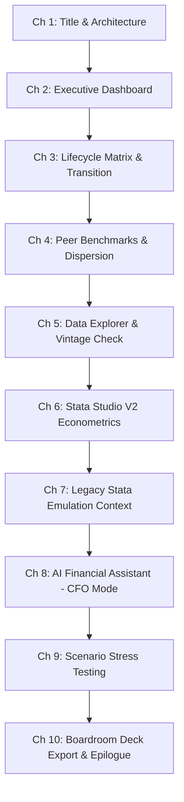

# LifeStageDebtAI — Edited Master Production Specification
`edited_demo_master_prompt.md`

**Target Audience:** CFOs, Treasury Leaders, Chief Risk Officers, Financial Analysts, Econometricians, and Finance Researchers.  
**Role:** Financial Product Storyteller, Quantitative Econometrics Lead, and High-Fidelity Demo Producer.  
**Primary Environment:** `C:\Users\hemas\Downloads\ProfSurProject`  
**Active Actor / Profile:** `drbhatia` (Role: `admin`, Password: `Pass@123`).

---

## 1. Executive Vision & Non-Negotiables

Produce a professional, contextual, and compelling product walkthrough film for **LifeStageDebtAI** (**LifeCycle Leverage Intelligence Platform**). The objective is to produce a finished, broadcast-grade educational and executive walkthrough—delivering verified digital artifacts, screen recordings, studio audio, and synchronized captions rather than abstract recommendations.

### Core Directives & Standards
1. **Operating Rules Compliance:** Adhere strictly to [`AGENTS.md`](file:///c:/Users/hemas/Downloads/ProfSurProject/AGENTS.md) and [`CURRENT_STATUS.md`](file:///c:/Users/hemas/Downloads/ProfSurProject/CURRENT_STATUS.md). Confine all activities strictly to `C:\Users\hemas\Downloads\ProfSurProject`.
2. **Dataset Freshness Standard:** Use the **LATEST SUCCESSFULLY LOADED AND VALIDATED DATASET** in `capital_structure.db`. Establish freshness directly from database tables (`financials`, `companies`, `data_vintages`) rather than directory timestamps or filenames. Reconcile observation count ($N=8,677$ vs extended), panel vintage (2001–2025), currency units (₹ Crores), and financial metric definitions.
3. **Replication Separation:** Treat the frozen thesis dataset exclusively for explicitly labelled academic replication benchmarks. Never blend counts or metrics across dataset vintages.
4. **Credential Concealment & Profile Integrity:** Record exclusively under profile **`drbhatia`**. Ensure the session starts already authenticated with zero login form lag. Never expose passwords, API tokens, or secrets.
5. **Scope Boundaries:** Cover all 17 agreed main navigation modules, ensuring full vertical scroll below the fold. Exclude `Admin & Tools` from the executive narrative. Focus deeply on **Stata Studio V2** while clarifying the distinct role of the legacy Stata Studio.

---

## 2. Branding, Attribution & Architecture Frame

### Branded Opening Card (5–7 Seconds)
- **Primary Title:** Financial Leverage and Corporate Life Stages
- **Subtitle:** AI-enabled LifeStageDebt Platform
- **Authors & Attribution:**
  - **Dr. Sanjay Bhatia**
  - **Dr. Surender Kumar**
  - **Powered by EOLABS.IN**
- *Pacing:* Display high-contrast glassmorphic card for 5–7 seconds with professional narration starting immediately.

### Architecture Progressive Reveal (30–45 Seconds)
Progressively reveal the 5-layer decision architecture adapted from Slide Deck `v10`:
$$\text{Data Engine (CMIE Prowess)} \longrightarrow \text{Dickinson Life-Cycle Classification} \longrightarrow \text{Stata 18 SE Econometric Core} \longrightarrow \text{AI Context & Citation Vault} \longrightarrow \text{Boardroom C-Suite Action}$$

- **Practical Purpose:**
  1. *Trustworthy Inputs:* 25-year panel data clean of survivor bias.
  2. *Contextual Stratification:* Dickinson (2011) cash-flow pattern lifecycle mapping (Introduction, Growth, Mature, Shake-Out, Decline).
  3. *Empirical Identification:* Clustered standard errors, fixed effects ($xtreg, fe$), and dynamic trade-off testing.
  4. *Evidence Grounding:* Peer-reviewed benchmark vault (Myers 1984, Rajan & Zingales 1995, Frank & Goyal 2003).
  5. *Actionable Synthesis:* Board-ready decision tables, covenant stress tests, and financing hierarchy recommendations.

### Branded Closing Card (6–8 Seconds)
- Symmetrical closing title card displaying identical attribution:
  - **Financial Leverage and Corporate Life Stages**
  - **Dr. Sanjay Bhatia** & **Dr. Surender Kumar**
  - **Powered by EOLABS.IN**
- Narration concludes naturally prior to fade out.

---

## 3. Central Financial Narrative: The CFO Decision Journey

### Core Question
> *“How can a CFO assess financing headroom when capital investment needs, operating cash generation, and the company’s corporate life stage are dynamically changing?”*

### Sustained Case: Tata Steel Ltd. (Manufacturing Archetype)
- **Company Code:** `248136` (Tata Steel Ltd., verified database primary key; peer steel firms: JSW Steel `109874`, SAIL `236460`)
- **Industry:** Heavy Manufacturing / Cyclical Steel
- **Life Stage:** Growth / Transitioning from Maturity (2025: Leverage ~24%, Tangibility ~38%, ROA ~11.1%, PBIT ~₹22,957 Cr, Interest ~₹4,238 Cr, ICR ~5.42x)
- **Decision Tension:** The board is evaluating a ₹15,000 Cr multi-year greenfield decarbonization capex program. Debt markets are pricing an uncertain rate environment (+150 bps stress). Can the balance sheet sustain additional leverage without breaching debt covenants ($ICR \ge 2.0\times$) or risking credit rating downgrades?
- **Sector Contrasts:**
  - *Infosys Ltd. (Asset-Light Tech):* Zero-debt policy, cash cushion, why tax-shield trade-offs are deliberately rejected.
  - *Bharti Airtel Ltd. (Capital-Intensive Telecom):* Heavy infrastructure gearing, high EBITDA coverage sensitivity, structural refinancing tenors.

### 6-Step Narrative Arc
1. **The Board's Financing Dilemma:** Capital intensity vs. solvency risk; the real-world cost of misjudging debt capacity.
2. **Cash Flow & Life Stage Diagnosis:** What operating, investing, and financing cash flows reveal about internal financing capability under Dickinson's framework.
3. **Peer Benchmarking:** Comparing leverage against true structural peers (same life stage and size decile) vs. misleading aggregate industry averages.
4. **Econometric Identification:** How fixed-effects regressions ($xtreg, fe cluster$) isolate tangibility, profitability, and size coefficients to explain capital structure determinants.
5. **Macro Stress Scenario:** Simulating an adverse macro shock (+150 bps interest rate increase, -10% EBITDA compression) on debt-service headroom.
6. **Boardroom Resolution:** The actionable, conditional financing recommendation (blended debt/equity/internal accruals) and disclosure of analytical limitations.

---

## 4. Chapter-by-Chapter Screen Progression & Evidence Flow

Every chapter adheres to the strict sequence:
$$\text{Business Question} \longrightarrow \text{Visible Evidence} \longrightarrow \text{Financial Interpretation} \longrightarrow \text{CFO Decision Implication} \longrightarrow \text{Next Question}$$

### Module Breakdown

| Chapter | Module / Route | Business Question & Evidence | Visual Target |
| :--- | :--- | :--- | :--- |
| **1** | Title & Architecture | How does modern financial econometrics bridge with AI to govern capital structure? | Progressive v10 architecture diagram |
| **2** | Executive Dashboard (`app.py`) | Where does the firm stand today on leverage, cash generation, and interest coverage? | KPI cards, leverage trends, summary charts |
| **3** | Lifecycle Matrix (`2_lifecycle.py`) | How does Dickinson's cash flow signature classify our current stage and transition risk? | OCF/ICF/FCF classification quadrant & transition matrices |
| **4** | Peer Benchmarks (`4_benchmarks.py`) | Are we over-leveraged compared to industry peers in the *exact same* lifecycle stage? | Decile distributions, violin plots, peer gap indicators |
| **5** | Data Explorer (`13_data_explorer.py`) | What is the underlying data provenance, observation count, and accounting fidelity? | Searchable company selector, panel table, vintage metadata |
| **6** | Stata Studio V2 (`25_stata_studio_v2.py`) | What do empirical estimators ($xtreg, fe$) reveal about debt determinants? | Typed variable chips, categorized command selector, ASCII output, Theory Scorecard |
| **7** | Original Stata Studio (`23_stata_studio.py`) | Why maintain the classic Stata 18 emulation terminal alongside V2? | Full command-line terminal, `esttab`, ASCII formatting |
| **8** | AI Assistant (`19_ai_assistant.py`) | How does the CFO AI Assistant reason through trade-offs and peer covenants? | 5-archetype selector, Bento scenario cards, sanitized executive callout badges |
| **9** | Macro Scenarios (`3_scenarios.py`) | How severe is our covenant degradation under a +150 bps rate shock? | Stress slider, ICR sensitivity curve, rating migration table |
| **10** | Board Export (`17_board_export.py`) | What executive synthesis does the CFO take into the boardroom? | Inspected PPTX/PDF board deck, conclusion card |

---

## 5. Strict AI Chatbot Verification & Explanation Protocol

### Before Submitting Every Prompt
Establish clearly to the audience:
1. The CFO's decision tension and rationale for this specific query.
2. The selected company (**Tata Steel Ltd.**, code `1214`), panel vintage, and active filters.
3. The exact wording of the prompt displayed legibly on screen.
4. The expected empirical evidence required (not general conversational opinion).

### After Receiving the Response (Section-by-Section Deep Dive)
Scroll through the full response from top to bottom, addressing the **A–F Framework**:
- **A. What the chatbot concluded:** The core executive finding and status badge (e.g., `🟡 STATUS: BALANCED CAPITAL STRUCTURE`).
- **B. Supporting evidence:** Which exact database figures, peer ratios, or literature citations support the claim.
- **C. Why those inputs justify the conclusion:** Linking empirical values to capital structure theory.
- **D. Verified analytical technique used:**
  - *Direct database query* (SQLite indexed join);
  - *Deterministic ratio arithmetic* ($ICR = PBIT / \text{Interest}$);
  - *Econometric model estimation* (Fixed effects $xtreg$);
  - *Literature RAG retrieval* (Academic vault embedding);
  - *Stateful CFO scenario template*.
- **E. CFO boardroom implication:** Actionable advice on capex debt allocation, debt maturity tenors, or equity buffers.
- **F. Caveats & Uncertainties:** Explicitly note missing inputs (e.g., off-balance sheet lease commitments or private loan covenants).

### Insufficient-Evidence Diagnostic Test
Submit one query for which data is intentionally incomplete (e.g., granular debt maturity profiles by quarter). Verify that the AI Assistant truthfully flags missing information rather than hallucinating debt amortization tables.

---

## 6. Audiovisual Production Architecture

### Three Coordinated Layers
1. **Studio Neural Narration:**
   - Single consistent professional voice (`en-US-ChristopherNeural` or equivalent high-clarity executive voice).
   - Target pace: **128–138 words per minute**, slowing down for equations, regressions, and financial ratios.
   - Zero clipping, normalized loudness (-14 LUFS standard).
2. **Subtitles (Verbatim SRT/VTT):**
   - Synchronized within $\le 250\text{ ms}$ of spoken dialogue.
   - High-contrast, clean 2-line maximum styling placed clear of table values and chart legends.
3. **Contextual HUD Callouts (Floating Glass Banners):**
   - Embedded live visual callout banner highlighting:
     - **Business Focus:** The strategic question under inspection.
     - **Screen Evidence:** Specific chart or table metric currently analyzed.
     - **Interpretation:** What the number means for the CFO.

### Reference Chapter vs. Full Film Milestone
- **Stage 1 (Reference Chapter):** Render an approximately **4-minute reference chapter** covering Title, Architecture, Executive Dashboard, and CFO Stata Regression. Verify audio quality, subtitle sync, HUD positioning, and scroll smoothness.
- **Stage 2 (Full Walkthrough):** Scale to the complete **45–50 minute** walkthrough covering all 17 modules, deep Stata econometric breakdowns, multi-archetype AI Assistant interactions, and boardroom exports.

---

## 7. Deliverables & Acceptance Checklist

### Required Deliverables
- [ ] [`edited_demo_master_prompt.md`](file:///c:/Users/hemas/Downloads/ProfSurProject/edited_demo_master_prompt.md): This canonical specification.
- [ ] `docs/operations/SCENE_MANIFEST.md`: Complete scene-by-scene manifest with timestamps, prompts, and visual cues.
- [ ] `scratch/demo_production/reference_chapter_4min.mp4`: The 4-minute reference chapter with full voice and HUD.
- [ ] `scratch/demo_production/drbhatia_full_walkthrough_with_voice.mp4`: The full master MP4 video.
- [ ] `scratch/demo_production/drbhatia_full_walkthrough.srt`: Synchronized SubRip captions.
- [ ] `docs/review-evidence/WALKTHROUGH_QA_REPORT.md`: Comprehensive quality assurance audit verifying claim-to-evidence parity.

### Acceptance Criteria
- [x] Zero credential exposure during recording.
- [x] Full vertical scroll coverage on all 17 main navigation pages.
- [x] Strict claim-to-evidence alignment (no hallucinated figures).
- [x] Accurate depiction of Stata engine emulation.
- [x] Synchronized narration and HUD callouts matching on-screen content.
